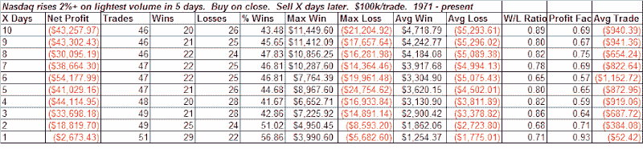
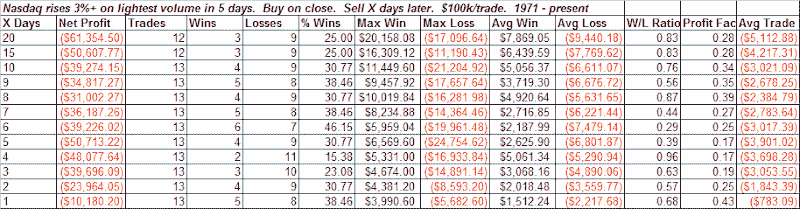

<!--yml
category: 未分类
date: 2024-05-18 13:36:21
-->

# Quantifiable Edges: Volume Clues

> 来源：[http://quantifiableedges.blogspot.com/2008/10/volume-clues.html#0001-01-01](http://quantifiableedges.blogspot.com/2008/10/volume-clues.html#0001-01-01)

The markets wild ride is virtually unprecedented when looking at price action. Determining the markets next move based price bars alone is difficult to dangerous at this time. My current focus is on volume. On Monday the Nasdaq rose over 11% yet the volume was the lowest in 5 days. Previously, the largest percent gain accompanied by a 5-day low in volume was under 6%.

To get a sizable number of occurrences I had to lower the % gain to 2%:

Indications are for weakness in the 5-10 days following such occurrences. Below is a table that appeared in last night’s

[Subscriber Letter](http://www.quantifiableedges.com/letter.html)

which looks at gains of 3% accompanied by the lowest volume in 5 days:

The larger % gains showed even worse performance.

As I type this morning the Nasdaq weakness is playing out. The Dow and S&P remain higher though. NYSE volume was also fairly unimpressive on yesterday’s rally. I’d be wary of further gains on low volume. I’d also continue to watch volume for clues at a time when price action is incredibly volatile.