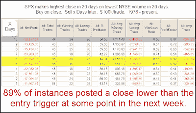

<!--yml
category: 未分类
date: 2024-05-18 13:15:42
-->

# Quantifiable Edges: Volume Low & Price High Often Leads to a Pullback

> 来源：[http://quantifiableedges.blogspot.com/2009/08/volume-low-price-high-often-leads-to.html#0001-01-01](http://quantifiableedges.blogspot.com/2009/08/volume-low-price-high-often-leads-to.html#0001-01-01)

The

[Quantifinder](http://www.quantifiableedges.com/quantifinderinfo.html)

came up with quite a few studies last. Below is one that last appeared in the June 15, 2009 Subscriber Letter. (Stats are updated through 8/13/09.)

(click to enlarge)

This would suggest a pullback over the next few days is likely. While the pullback hasn’t necessarily been severe, it has been consistent.

-------------------

If you haven't taken a free trial before and would like to, simply

[click here to sign up](http://www.quantifiableedges.com/members/register.php)

and check out the Quantifineder and our other services.

**For those that may have trialed prior to the release of the Quantifinder in June, if you'd like another trial just send a request to support @ quantifiableedges.com (no spaces).**

And remember, the

[Q1 2008 studies package comes free with all annual subscriptions](http://quantifiableedges.blogspot.com/2009/08/dog-days-of-summer-special-promotion.html)

.