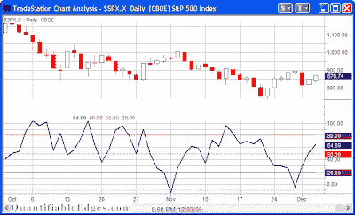
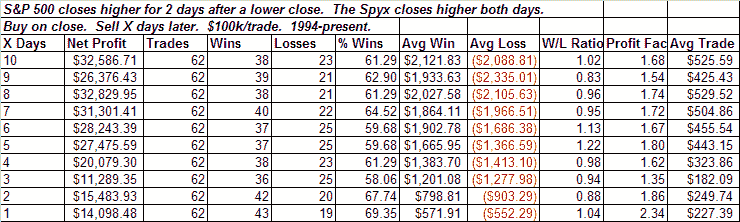
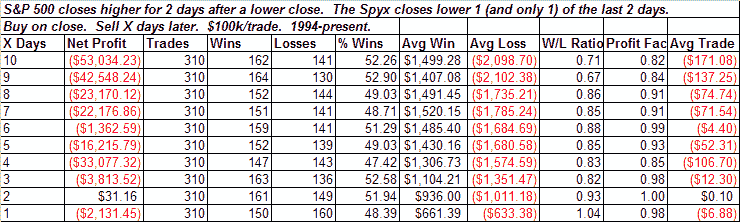
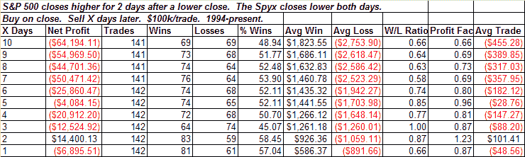
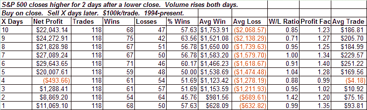
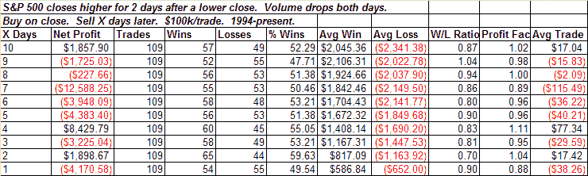

<!--yml
category: 未分类
date: 2024-05-18 13:32:23
-->

# Quantifiable Edges: Volume Spyx Patterns

> 来源：[http://quantifiableedges.blogspot.com/2008/12/volume-spyx-patterns.html#0001-01-01](http://quantifiableedges.blogspot.com/2008/12/volume-spyx-patterns.html#0001-01-01)

A quick look at the S&P 500 Volume Spyx chart below (and available each night on the

[home page](http://www.quantifiableedges.com/)

) shows that while the market rallied on Tuesday and Wednesday the Spyx level rose. This is in contrast to other recent rallies where the Spyx fell as the market rose. This is potentially a good sign. Let’s look at the volume Spyx pattern in detail to see why it may be a positive. Then I’ll offer my thoughts at this time and also compare it to standard volume patterns. (Those not familiar with Volume Spyx may

[click here to learn more](http://quantifiableedges.blogspot.com/2008/11/introducing-volume-spyx.html)

.)

First, below is a table showing data when a two-day market rise occurs with increasing Spyx levels:

While not overwhelmingly bullish, there is a clear upside edge over the next 1-10 days based on this pattern – especially day 1\. The average day over the entire time period only gained $24, so the difference is substantial.

Now let’s see what happens when only 1 of the days occurs with a rising Spyx:

Very choppy action with a slight negative overall tilt.

What if the Spyx sinks both days while the market rises?

Results here are quite a bit worse on average. It’s still close to a 50/50 proposition but risks clearly outweigh rewards.

I did look at how the 1st (bullish) test has performed over the especially choppy and bearish period from 6/1/07 to now. Over this time there have only been 4 instances and results were split. As challenging as the current market is I’m not prepared to view the results in a clearly bullish light. I do think it’s better than seeing either of the alternatives though.

Lastly, I took a look at running similar tests using straight volume instead of the Quantifiable Edges Volume Spyx to see if it provided the same edges. First I present the “bullish scenario” with two up days on rising volume:

Here again we see an upside bias. The problem is it is not nearly as pronounced as when using the Spyx. In fact it’s about equal with the long-term drift of the market, which suggests no significant edge.

What if we look at the bearish Spyx scenario using volume as a substitute?

Rather than clear downside edge what we have here is again less pronounced. The suggestion is chop rather than true downside.

Several times lately I have substituted Volume Spyx levels for actual volume levels in testing patterns and found the edge to be more pronounced. The S&P 500 volume Spyx is updated each night

[on the home page](http://www.quantifiableedges.com/)

. It can be viewed for free.

[Gold level subscribers](http://www.quantifiableedges.com/gold.html)

are able to download historical data on both S&P 500 and Nasdaq Volume Spyx Levels each night for research or further evaluation.

I will continue to provide updates and research associated with this newly published tool.