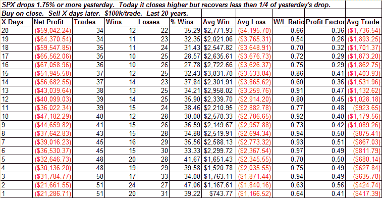

<!--yml
category: 未分类
date: 2024-05-18 13:29:47
-->

# Quantifiable Edges: Weak Bounce Not Encouraging

> 来源：[http://quantifiableedges.blogspot.com/2009/01/weak-bounce-not-encouraging.html#0001-01-01](http://quantifiableedges.blogspot.com/2009/01/weak-bounce-not-encouraging.html#0001-01-01)

After selling off hard on Friday and Monday the S&P put in a weak bounce on Tuesday. We've seen this pattern before and it has historically led to more selling. An updated table from

[the previous study](http://quantifiableedges.blogspot.com/2008/08/weak-bounce-is-not-encouraging.html)

is below:

