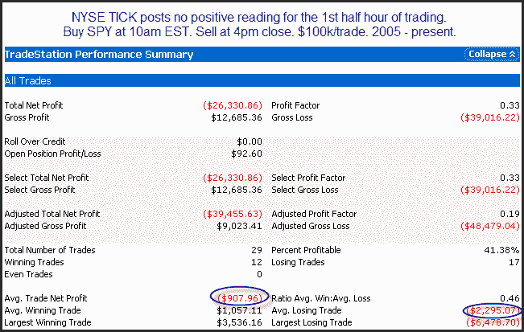
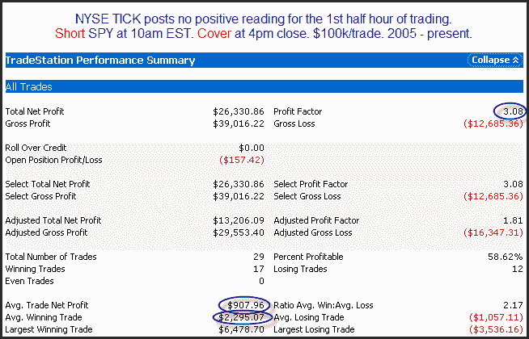

<!--yml
category: 未分类
date: 2024-05-18 13:05:28
-->

# Quantifiable Edges: What A Very Weak Early TICK Has Led To In The Past

> 来源：[http://quantifiableedges.blogspot.com/2010/02/what-very-weak-early-tick-has-led-to-in.html#0001-01-01](http://quantifiableedges.blogspot.com/2010/02/what-very-weak-early-tick-has-led-to-in.html#0001-01-01)

The market is off to a horrible start today.

[Back in November I looked](http://quantifiableedges.blogspot.com/2009/11/what-strong-early-tick-has-meant-in.html)

at days that started off strong and did not register a negative TICK reading for the entire first half-hour. Strong starts often led to strong finishes. Today there were

*no positive*

TICK readings for the 1st half-hour. This kind of weakness happens quite rarely. When it has occurred in the past, it’s made for some very rough days. Below are statistics showing the 10am – 4pm EST performance after such weak starts.

Certainly not a knife you want to normally try and catch.

For those who would rather view it as a short-selling opportunity, here’s how it looks from the short side.

No matter how you view it, very weak starts like today tend to carry big risk and little reward for the bulls for the remainder of the day.