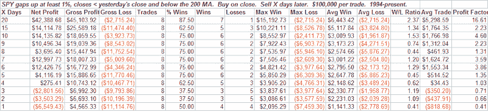
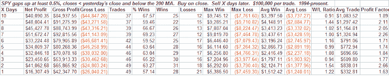

<!--yml
category: 未分类
date: 2024-05-18 08:12:21
-->

# Quantifiable Edges: What Happens After Gaps Up Fail

> 来源：[http://quantifiableedges.blogspot.com/2008/07/what-happens-after-gaps-up-fail.html#0001-01-01](http://quantifiableedges.blogspot.com/2008/07/what-happens-after-gaps-up-fail.html#0001-01-01)

It was another tough day for the bulls. Large gaps up in downtrends tend to provide an edge to the upside. My thought going into the day was that the large gap may cause a short-covering panic that would lead to a nice trend day higher. It didn’t come close as the market dropped right from the first few minutes.

Reversals like this always look ugly, but I thought I’d take a little closer look.

Using the SPY I checked all other times there was a gap up of over 1% and then a close at a 200-day low. Today was the first. So I loosened some parameters.

A choppy beginning but once you get out a few weeks things look very good. An average trade of over 5% in the next 4 weeks is impressive. Of course the number of instances is extremely small. So I lowered the gap requirement to 0.5%:

Nothing mind-blowing but over the next 1-2 weeks it showed a decent upside edge. Of course there has been a multitude of reasons the market should bounce for a while now.