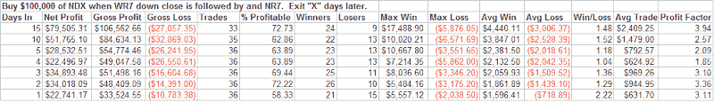

<!--yml
category: 未分类
date: 2024-05-18 08:27:31
-->

# Quantifiable Edges: What Happens When Range Rapidly Contracts

> 来源：[http://quantifiableedges.blogspot.com/2008/04/what-happens-when-range-rapidly.html#0001-01-01](http://quantifiableedges.blogspot.com/2008/04/what-happens-when-range-rapidly.html#0001-01-01)

In the 1980’s Tony Crabel published research on Wide Range Bars and Narrow Range Bars.

He introduced the concept of WR7’s and NR7’s.

A WR7 is a bar whose range is wider then the previous 6 bars.

An NR7 is a bar whose daily range is narrower than the previous 6 days.

Others have done work with WR and NR bars since then including Linda Bradford Raschke and Larry Connors – both separately and together.

Their book Street Smarts contains a pattern which uses historical volatility and NR4 bars to look for explosive moves.

The market’s steep selloff on Friday created a WR7 bar.  On Monday the selling quieted and the market actually put in an NR7 day.  While volatility tends to be mean reverting, it’s unusual to see it contract that fast.  I look at the action in the NDX back to 1986 when a WR7 with a lower close was followed by an NR7 the next day.  Buying on the close of the NR7 day and holding for “X” days achieved the following results:

It appears the inability of the sellers to follow-through after the wide range day down invites buying over the next several days. In the very-short term (1-3 days) the bias is strongly bullish.  Consider the fact that the average day over the period tested was a 0.06% gain.  The one day performance following this setup was over 10-times a normal day and over three days it outperformed and average three days by over 5-times.  The high win rate and average win size consistently higher than the average loss make this setup intriguing.

A few other notes: 1) Whether the NR7 day was positive or negative had little impact on performance and was not differentiated in the results above.  2) A WR7 up bar is a less bullish setup – but I’ll look at that in more detail when the time is appropriate.