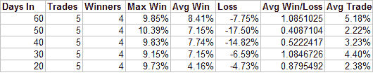
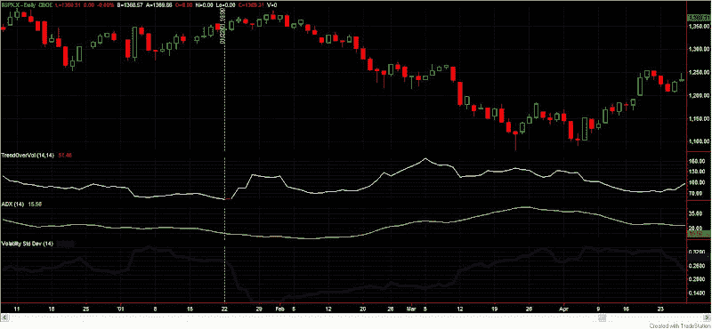
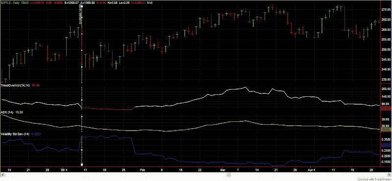
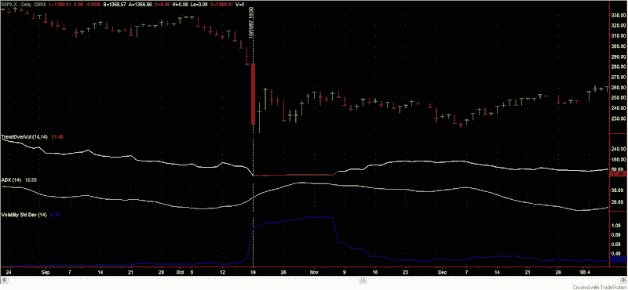

<!--yml
category: 未分类
date: 2024-05-18 08:28:44
-->

# Quantifiable Edges: What The Low VIX May Be Indicating

> 来源：[http://quantifiableedges.blogspot.com/2008/04/what-low-vix-may-be-indicating.html#0001-01-01](http://quantifiableedges.blogspot.com/2008/04/what-low-vix-may-be-indicating.html#0001-01-01)

With all the recent volatility in the market, many traders have noted the recent low VIX levels and wondered if that was a sign of complacency. Low VIX readings relative to their short-term moving averages do sometimes presage market pullbacks. While one use of the VIX is trying to predict the direction of the market. That really isn’t what the VIX represents. It represents options traders perception of future volatility. So perhaps the low VIX means they know something?

One of the most unusual aspects of the recent environment is how volatile it has been in a virtually trendless market. Wild swings within a range. Lots of chop. To quantify this action I took the 14-day ADX of the SPX (15.56) and divided it by the 14-day historical volatility (volatilitystddev in Tradestation terms), which currently stands at 0.3023\. The result (about 51) is what I call trend over volatility (TOV). Charting this helps to see other times where volatility was high and the market wasn’t trending.

Going back to 1960 I was only able to find 5 other periods where the TOV was below 55\. Looking at the performance of the market “X” days out gave the following results:

Four pretty strong winners and one sizable loser. Interesting, but perhaps not compelling enough for a directional bet on its own. (Combined with my other recent studies it may be.)

To try and glean a little more I looked at the charts. The top line is TOV. The yellow line is ADX. The blue line is Historical Volatility. The vertical line shows when the TOV dropped to 55 or lower. (Click charts to enlarge.)

October 2002

January 2001

February 1999

January 1988

October 1987

The one thing that stuck out to me? In every case, at some point in the next month there was a sharp drop in historical volatility. In ’87 and ’88 it took about 3 weeks. The other times it was almost immediate. Does the VIX know something? It just might.

Perhaps those uncomfortable with directional bets in the current market might prefer to use options and bet on a reduction in volatility.

I haven’t done too much with this indicator yet, but I suspect it could have applications for individual stocks as well.

Tradestation users who wish to play with this indicator and concepts more may purchase and download the indicator, study, and workspace

[at the studies section of the Quantifiable Edges website](http://www.quantifiableedges.com/studies.html)

for $12.00\. I made the inputs for length on both ADX and Historical Volatility flexible so that it can easily be fine tuned.