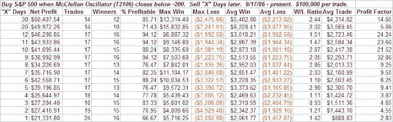
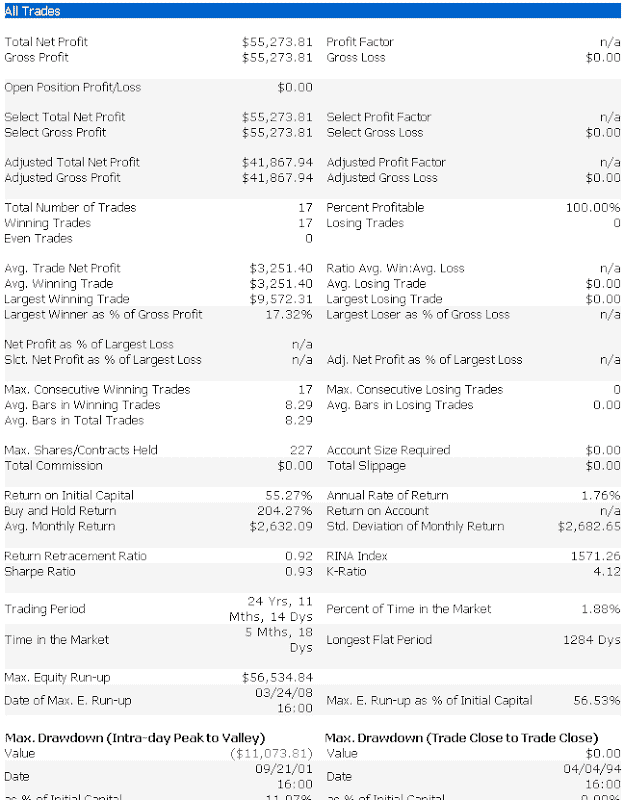

<!--yml
category: 未分类
date: 2024-05-18 08:14:58
-->

# Quantifiable Edges: What The McClellan Oscillator Is Suggesting

> 来源：[http://quantifiableedges.blogspot.com/2008/06/what-mcclellan-oscillator-is-suggesting.html#0001-01-01](http://quantifiableedges.blogspot.com/2008/06/what-mcclellan-oscillator-is-suggesting.html#0001-01-01)

The McClellan Oscillator is a measure of breadth developed by Sherman and Marian McClellan. If you are not familiar with the McClellan Oscillator I would suggest you familiarize yourself with it, as it can be quite valuable in assessing the market. Here is

[a link to the McClellan’s website](https://www.mcoscillator.com/Oscillator.html)

. In general, strong breadth numbers (NYSE advancing issues minus declining issues) cause the oscillator to rise, and weak breadth numbers cause it to fall. A good portion of the time you’ll find the oscillator value to lie between -100 and +100.

As with most breadth and volume indicators, the value for the McClellan Oscillator varies a bit depending on your data provider. For instance, tonight the reading on the McClellan’s website was about -245, Tradestation was showing -240, and Worden Bros. TC2000 was showing -204\. Since I was encountering some issues with the Tradestation data and don’t currently have the McClellan’s official historical database, I used the TC2000 data for tonight’s testing. TC2000 users may find it listed as T2106 on their symbol list. In general, the data provider doesn’t normally matter as long as you are consistent in your testing. The data goes back to 1986.

Readings of less than -200 are uncommon and often signal an impending short-term reversal. To illustrate I ran a few tests. The first one looks to buy the S&P 500 on any dip in the McClellan Oscillator below -200 and sell “X” days later. Results below:

Sixteen for seventeen 11 and 12 days out. High average trade. This appears to provide a quantifiable edge.

For the next test I devised a strategy that would buy when the oscillator dropped below -200 and then sell when it moved back above zero. Below is a screenshot of the performance report for this strategy.

Seventeen for seventeen with an average profit of 3.25% and an average holding period of 8 days.

The CBI isn’t the only breadth indicator suggesting an edge to the long side.