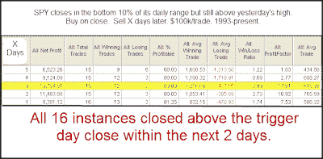

<!--yml
category: 未分类
date: 2024-05-18 13:16:51
-->

# Quantifiable Edges: What Thursday's Unfilled Gap & Poor Close Might Mean

> 来源：[http://quantifiableedges.blogspot.com/2009/07/what-thursdays-unfilled-gap-poor-close.html#0001-01-01](http://quantifiableedges.blogspot.com/2009/07/what-thursdays-unfilled-gap-poor-close.html#0001-01-01)

The late-day selloff may have

*felt*

bearish on Thursday. One very simple study I ran last night suggested otherwise...

(click image to enlarge)

The number of instances was a little bit low. These results are strongly suggestive of upside over the next few days, though. The profit factor (gross gains / gross losses) over the first 3 days is especially impressive. Also compelling is the fact that every instance saw at least 1 close above the trigger day close within the next day or two.