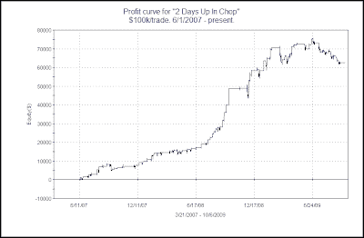
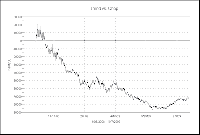

<!--yml
category: 未分类
date: 2024-05-18 13:12:41
-->

# Quantifiable Edges: What's Happened To "2 Days Up In Chop"?

> 来源：[http://quantifiableedges.blogspot.com/2009/10/whats-happened-to-2-days-up-in-chop.html#0001-01-01](http://quantifiableedges.blogspot.com/2009/10/whats-happened-to-2-days-up-in-chop.html#0001-01-01)

A few weeks ago I discussed the performance of the [“2 Days In Chop” systems](http://quantifiableedges.blogspot.com/2009/09/2-days-in-chop-systems-1-year-later.html).  After doing extremely well through June, I noted the systems had faltered a bit lately.  The primary reason for the struggle over the last few months has been that the “2 Days Up In Chop” system has done poorly.

Below is an equity curve of [“2 Days Up In Chop”](http://quantifiableedges.blogspot.com/2008/08/short-system-for-handling-chop_28.html).

The poor performance of “2 Days Up In Chop” can be attributed the strongly trending rally that has taken place.  “2 Days Up In Chop” triggered again on Tuesday afternoon.  I effectively suspended use of it as an indicator a while back.  Should the market top out or enter a period of consolidation, or even simply undergo a deceleration in its uptrend, then “2 Days Up In Chop” may begin working again.  I’ll continue to monitor the equity curve as a gauge of market behavior.  Equity curves of simple systems such as this are a nice way to look under the hood of the market and understand what’s working and what isn’t in the current environment.

The Trend vs. Chop equity curve is one I update weekly on the subscriber site.  It shows the effect of buying all up days and shorting all down days.  In a choppy environment the line will fall.  A rising line suggests a more trendy environment.  For more discussion on this chart you may see [this post from a little over a year ago](http://quantifiableedges.blogspot.com/2008/08/how-to-trade-choppiest-environment-in.html).  A current chart is below.

As you might suspect, the strong move up has been accompanied by unusually trendy behavior.