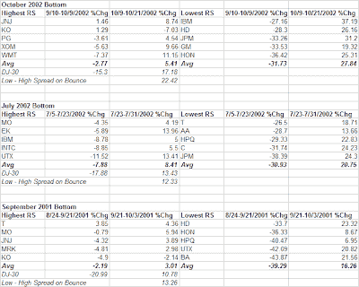
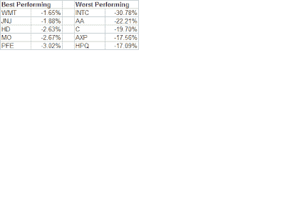

<!--yml
category: 未分类
date: 2024-05-18 08:36:38
-->

# Quantifiable Edges: What stocks will benefit the most when the market bounces?

> 来源：[http://quantifiableedges.blogspot.com/2008/01/what-stocks-will-benefit-most-when.html#0001-01-01](http://quantifiableedges.blogspot.com/2008/01/what-stocks-will-benefit-most-when.html#0001-01-01)

When the market bounces, what do you want to be buying? Contrary to popular belief, the stocks that held up the best during the selloff, do NOT perform the best on the bounce. In fact, it’s quite the opposite. Below are snapshots of the best (Highest RS) and worst (Lowest RS) performing Dow stocks on a few recent waterfall declines. I show the amount they declined prior to the bottom and then how much they bounced during the course of the initial move off the lows (6-8 days). I also show what the Dow did over the same time period.

In every case, the Lowest RS stocks outperformed the Highest RS by an amount close to or greater than the bounce in the Dow! In other words, a spread trade could have achieved returns close to or better than simply going long the index. Careful, though. A spread trade between the best 5 and worst 5 does NOT eliminate the need for market timing. Typically the least favorable stocks will remain so until the market actually turns. When it does turn, though – look to the most beat up stocks to give the best bounces.

Below are the top 5 and bottom 5 Dow stocks since the swing high of December 26, 2007:

