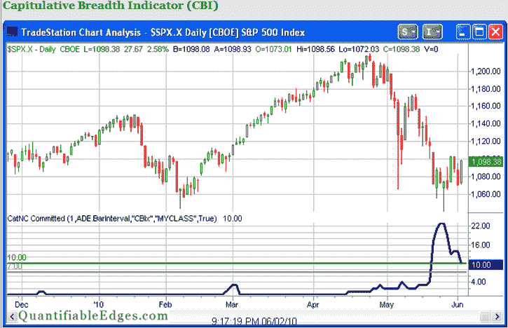

<!--yml
category: 未分类
date: 2024-05-18 12:59:19
-->

# Quantifiable Edges: What the CBI's Extended Stay in Double Digits Suggests

> 来源：[http://quantifiableedges.blogspot.com/2010/06/what-cbis-extended-stay-in-double.html#0001-01-01](http://quantifiableedges.blogspot.com/2010/06/what-cbis-extended-stay-in-double.html#0001-01-01)

Since the Capitulative Breadth Indicator (CBI) spiked a couple of weeks ago I’ve been updating it each afternoon on Twitter.

[Http://twitter.com/qerob](http://twitter.com/qerob)

Below is an updated chart of recent activity from the members section of the website.

The CBI closed Wednesday at 10, which is as low as it has been lately. This is now the 9th trading day in a row with a close of 10 or higher - a very long stretch for such an extreme reading. This raises the question of whether having such strongly oversold stocks take so long to bounce suggests anything. Is this failure of the CBI to drop back down a sign of more market weakness to come? Or does it suggest that perhaps it is just taking some time to carve out a meaningful bottom?

I ran some tests and frankly there weren’t enough instances to tell. The only two other instances where the CBI managed to stay above 10 for at least 9 days were 12/16/96 and 9/28/01\. In both cases we saw strong rallies that lasted at least a couple of months. If I loosen the requirement to only requiring the CBI to remain at 10 or above for at least 6 days rather than 9, then two more instances arise. They were on 9/4/98 and 7/25/02\. These didn’t mark bottoms but they were followed by powerful 1-month rallies.

This isn’t decisive proof that a rally is about to emerge. Still, the stubbornly high CBI certainly doesn’t appear to be bad news.