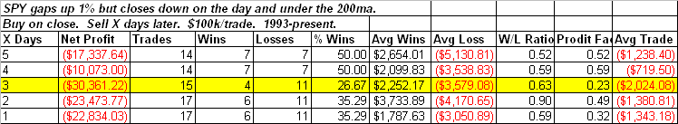

<!--yml
category: 未分类
date: 2024-05-18 13:25:32
-->

# Quantifiable Edges: When SPY Gaps Up 1% And Closes Negative

> 来源：[http://quantifiableedges.blogspot.com/2009/03/when-spy-gaps-up-1-and-closes-negative.html#0001-01-01](http://quantifiableedges.blogspot.com/2009/03/when-spy-gaps-up-1-and-closes-negative.html#0001-01-01)

What stood out to me about Monday was the fact that the market gapped higher by such a large amount and failed to close positive on the day. Below I look at other times the SPY gapped up 1% and finished negative.

While instances are a bit low, additional downside follow through was often seen over the next 1-3 days.