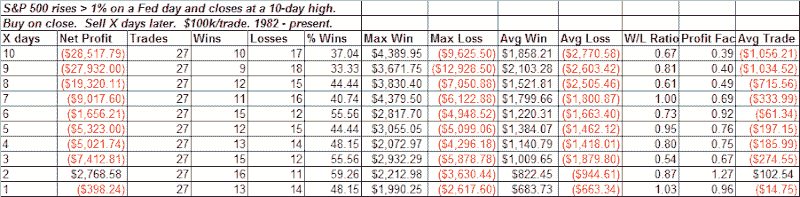

<!--yml
category: 未分类
date: 2024-05-18 13:31:54
-->

# Quantifiable Edges: When The Fed Sparks A Rally To A 10-day High

> 来源：[http://quantifiableedges.blogspot.com/2008/12/when-fed-sparks-rally-to-10-day-high.html#0001-01-01](http://quantifiableedges.blogspot.com/2008/12/when-fed-sparks-rally-to-10-day-high.html#0001-01-01)

Last night I looked at all times since 1982 the S&P 500 rose 1% or more on a Fed day and closed at a 10-day high:

The edge isn’t as prevalent initially, but over the next 2 weeks a downside tendency can be observed. Not shown above is that 70% of all instances closed below the close of the Fed day within the next 3 days. While this isn’t one of the strongest edges we’ve seen, it does suggest a pullback is the odds-on play. I also thought it was worth adding to the Fed Day Studies.