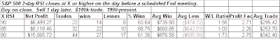

<!--yml
category: 未分类
date: 2024-05-18 13:25:24
-->

# Quantifiable Edges: When The S&P Is Overbought Going In To A Fed Day

> 来源：[http://quantifiableedges.blogspot.com/2009/03/when-s-is-overbought-going-in-to-fed.html#0001-01-01](http://quantifiableedges.blogspot.com/2009/03/when-s-is-overbought-going-in-to-fed.html#0001-01-01)

Wednesday is an FOMC meeting. In the past

[I’ve produced numerous studies examining how the market has performed surrounding these meetings](http://quantifiableedges.blogspot.com/search/label/Fed%20Study)

. One scenario I have not yet shown is how the market has performed when it is short-term overbought go into the meeting. For this test I used a 2-day RSI to measure different levels of overbought.

(click to enlarge)

Over the last 19 years when the market has had positive momentum going into a meeting it has most often been able to maintain that momentum through the day of the announcement.