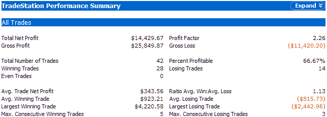

<!--yml
category: 未分类
date: 2024-05-18 13:42:28
-->

# Quantifiable Edges: When The S&P Is Oversold Going Into A Fed Day

> 来源：[http://quantifiableedges.blogspot.com/2008/08/when-s-is-oversold-going-into-fed-day.html#0001-01-01](http://quantifiableedges.blogspot.com/2008/08/when-s-is-oversold-going-into-fed-day.html#0001-01-01)

The S&P fell on Monday for the third consecutive day. There are some short-term price indicators reaching oversold levels at this point. More often than not, when the market goes into a Fed meeting and is short-term oversold, the result is a bounce. For tonight’s test I used the 2-period RSI. I looked at any time since 1978 the S&P 500 closed with a 2-period RSI reading below 20 the day before a scheduled Fed meeting. (I did not include unscheduled Fed meetings, since they all pretty much pop the market.) Summary results of all qualifying Fed days are shown below. They assume buying at the close the day before the Fed meeting and selling on the close the day of the Fed meeting. (Based on $100,000 per trade in the S&P cash index.):

Based on this, there appears to be a small edge to the upside for Tuesday.