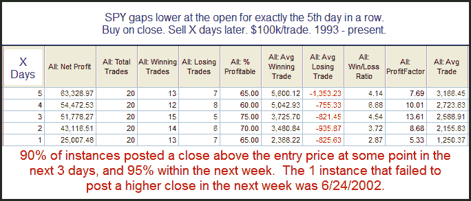

<!--yml
category: 未分类
date: 2024-05-18 12:55:43
-->

# Quantifiable Edges: When The SPY Continually Gaps Lower...

> 来源：[http://quantifiableedges.blogspot.com/2010/08/when-spy-continually-gaps-lower.html#0001-01-01](http://quantifiableedges.blogspot.com/2010/08/when-spy-continually-gaps-lower.html#0001-01-01)

Last night both Cobra of

[Cobra's Market View](http://cobrasmarketview.blogspot.com/)

and Mr. Ice of

[ETF Prophet](http://www.etfprophet.com/)

noted that Monday was the 5th day in a row that the market gapped down to start the day. Pre-market trading is dominated by the pros. Retail traders typically don’t trade until the official open at 9:30am EST. I’ve heard in the past that big institutions that want to buy will sometimes try and push futures lower in the morning when there isn’t as much liquidity. They do this with the intention of buying at the open (at cheaper prices) when liquidity comes into the market. Of course news and trading of foreign markets overnight will also have much to do with the open. In any event, 5 gaps down in a row is fairly rare. It raises the question, “Does a consistently cheap open provide an edge going forward?” Let’s take a look:

Instances are a little low but they sure offer some compelling evidence for the bull case.