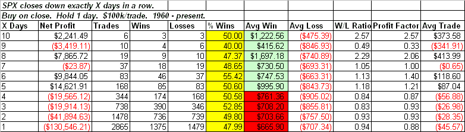
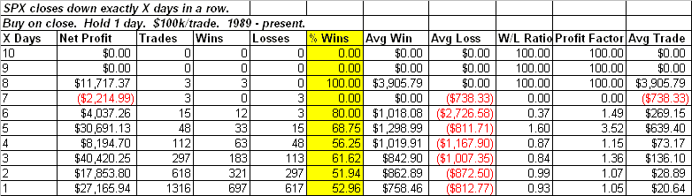
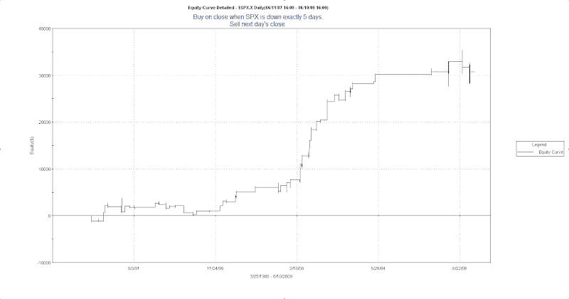

<!--yml
category: 未分类
date: 2024-05-18 13:19:37
-->

# Quantifiable Edges: Where The Edge Lies When The Market Drops X Days In A Row

> 来源：[http://quantifiableedges.blogspot.com/2009/06/where-edge-lies-when-market-drops-x.html#0001-01-01](http://quantifiableedges.blogspot.com/2009/06/where-edge-lies-when-market-drops-x.html#0001-01-01)

A few weeks ago I wrote

[a post that illustrated the edge buying 3 down closes has produced](http://quantifiableedges.blogspot.com/2009/05/3-lower-closes-largely-misunderstood.html)

over time. There are a lot of ways to expand on the research in that post. Today I’m going to look briefly at what its meant to be down “X” number of days in terms of an edge for the next trading day.

The table below looks at performance the day following a drop in the SPX of exactly X days in a row.

A few things caught my eye here. The first is the % Wins column. It stayed pretty close to 50% no matter how many down days you’ve had. Basically a coin flip either way. The 2nd column that caught my eye was the Avg Win column. This is the column that provides an edge when you get further out. In general the more stretched market the stronger the bounce is likely to be.

As I showed in the post that focused on 3 days down, the edge has changed over the years. More recently there has been a greater tendency for the market to reverse rather than trend. Below is the same table for the 1989 – present time frame.

The % wins column here shows that the tendency to reverse after being down several days has grown stronger in the last 20 years. As in the 1st table, the Avg Win increases as the SPX gets more stretched.

I demonstrated with the “Down 3 Day” trade that much of the edge has come quite recently. Below is an equity curve for being down 5 days.

Much the same here. A good majority of the edge is attributable to the last several years.

My takeaway is this. There is a long-side edge after the market has pulled back for several days in a row. A large part of the edge comes not from the chances the market will rise the next day, but the fact that you will be rewarded amply if it does. If you understand this and perhaps combine the fact that the market is down multiple days with other indications that a reversal is likely, then you can likely identify a strong upside edge.