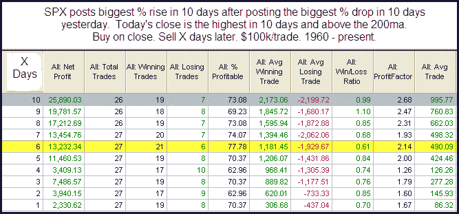
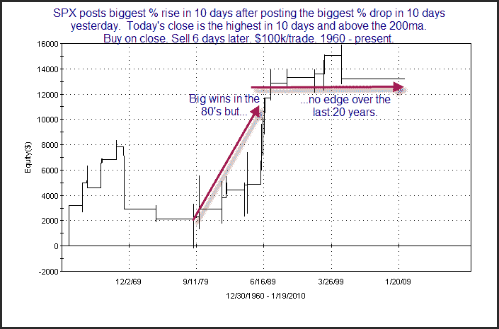

<!--yml
category: 未分类
date: 2024-05-18 13:06:37
-->

# Quantifiable Edges: Why I Always Look Deeper Than The Stats Table

> 来源：[http://quantifiableedges.blogspot.com/2010/01/why-i-always-look-deeper-than-stats.html#0001-01-01](http://quantifiableedges.blogspot.com/2010/01/why-i-always-look-deeper-than-stats.html#0001-01-01)

The evidence I most often show when illustrating a study is a statistics table like the one below. But it’s not all I look at and it never tells the whole story. In the subscriber letter I’ll often go into more detail on some of the studies. Tonight I thought I’d show an example of one study whose stats table I consider to be a poor representation of the truth.

Tuesday’s rally was the biggest % gain in at least 10 days. It followed Friday’s selloff which was the biggest % drop in at least 10 days. With the market trading above the 200ma and a new 10-day high being made on Tuesday, it made for an unusual setup. Below is a stats table showing similar setups in the past.

From the stats table it appears there is a fairly strong inclination for more upside over the next several days. Now let’s zoom in a bit on some of the results. I chose to zoom in on the 6-day here exit since that had the highest win %. Below is an equity curve with the 6-day exit strategy.

While the surface stats looked good, this chart tells a much different story. For one, there haven’t been any instances in nearly 10 years. Also, the 10 years prior to that there were only 5 instances and the return from them was breakeven. In other words, it’s been over 20 years since any edge has been exhibited by this study. In fact, just about the entire “edge” appears to be thanks to the 80’s. So while the initial results looked substantially bullish, this is definitely not a study that I would want to base a trade on. Traders who conduct their own studies should keep this lesson in mind. It's important to carefully examine all results and not jump to conclusions based of the first set of numbers.