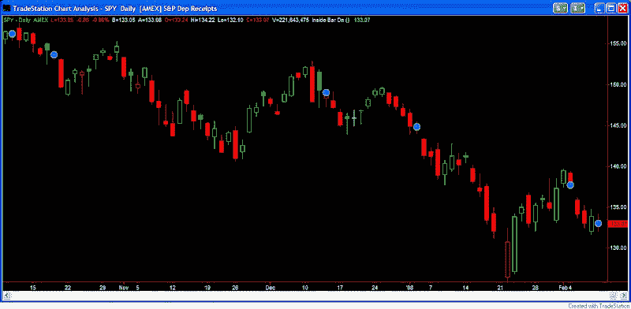

<!--yml
category: 未分类
date: 2024-05-18 08:34:46
-->

# Quantifiable Edges: Why Inside Days Get Me Down

> 来源：[http://quantifiableedges.blogspot.com/2008/02/why-inside-days-get-me-down.html#0001-01-01](http://quantifiableedges.blogspot.com/2008/02/why-inside-days-get-me-down.html#0001-01-01)

Friday was an inside day. For me that meant laying in bed most of the day trying not to vomit. For the market that meant a lower high and a higher low than Thursday causing Friday’s range to be completely “inside” Thursday's range. The indices also closed lower on the day. Below is a chart of the SPY going back to October 8th, which was the day it closed at its highest level. Every inside day with a down close is marked with a blue dot.

The return following each of the inside days with a down close is as follows: -0.48%, -2.62%, -1.27%, -2.45%, -2.64%. That is an average loss of 1.9% the following day. Five for five losers. The pattern isn’t pretty.

Even before the recent market top, this pattern has had bearish tendencies. Looking back to the beginning of 2004, there have been 53 inside days with down closes for the SPY. Sixty-four percent of them were followed by a selloff the following day. The average loss was about 0.7% and the average gain 0.5%. Total losses outsized total gains by 2.3 to 1.

Looking back even further, since the 2000 market top, the SPY has closed down 58% of the time following an inside day with a down close. There were 104 occurrences. The average loss the next day was 0.9% while the average gain was 0.6%. In all total losses outsized total gains by about 2.1 to 1.

Friday’s pattern may have been an ideal one for me while trying to deal with the flu. For the market, the pattern has historically signaled short-term trouble.

----------------------------------------

Two other quick notes:

After conducting the study I did a search on “stock market inside day”. Dr. Steenbarger had an

[interesting study](http://traderfeed.blogspot.com/2006/06/inside-day-with-less-fear-what-it.html)

regarding them a couple of years ago.

In the comments section after my study of leadership breadth at market bottoms on Thursday night there was some discussion of the importance of looking at new low figures near market bottoms. Dr. Steenbarger also saved me some time this weekend and wrote a nice post on

[new lows near market bottoms](http://traderfeed.blogspot.com/2008/02/getting-close-to-bottom.html)

. Thank you Dr.! (Now how about a little something for the nausea?)