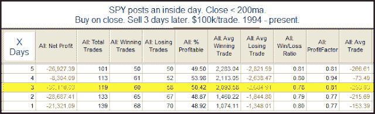
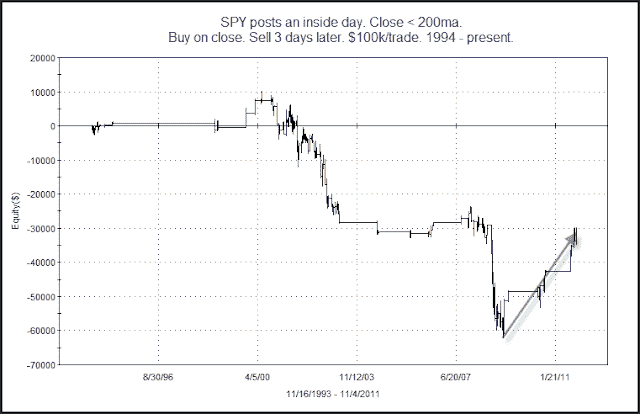

<!--yml
category: 未分类
date: 2024-05-18 08:54:26
-->

# Quantifiable Edges: Why Inside Days No Longer Get Me Down

> 来源：[http://quantifiableedges.blogspot.com/2011/11/why-inside-days-no-longer-get-me-down.html#0001-01-01](http://quantifiableedges.blogspot.com/2011/11/why-inside-days-no-longer-get-me-down.html#0001-01-01)

SPY failed to make either a higher high or a lower low than the day before. This is often referred to as an “inside day” because the range was completely inside the previous day’s range. In the past I have shown how inside days under the 200ma have often been followed by moves lower. What’s interesting is that while that held true for a long time, since the bottom in 2009 it has not been the case. Let’s first look at an updated results table based on this setup.

As you can see the statistics still appear bearish, with the downside edge basically playing out over the 1

^(st)

3 days.  But now let’s take a look at the profit curve.

As you can see over the last two years (and 15 or so instances) the setup has not provided a downside edge.  Both the 1-day and 2-day profit curves looked very similar to this. 

It is important to understand when historical instances provide a directional edge.  But the market is always evolving.  And sometimes setups that provided an edge for a long time will either stop working or will go a period of time without demonstrating the same tendency.  It is important to monitor not only how has a setup performed over the long term, but also keep an eye on recent instances to ensure that edge is still being provided.  In this case it doesn’t seem to be.