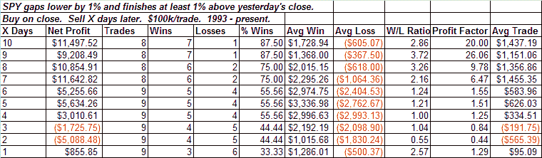
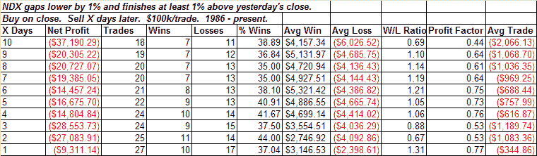

<!--yml
category: 未分类
date: 2024-05-18 13:38:46
-->

# Quantifiable Edges: Why It's Dangerous To Jump To Conclusions With A Small Sample Set

> 来源：[http://quantifiableedges.blogspot.com/2008/09/why-its-dangerous-to-jump-to.html#0001-01-01](http://quantifiableedges.blogspot.com/2008/09/why-its-dangerous-to-jump-to.html#0001-01-01)

Below are a couple of tests I showed in Thursday night’s

[Subscriber Letter](http://www.quantifiableedges.com/letter.html)

. They provide a nice example of why it’s dangerous to quickly jump to conclusions without solid evidence and a decent sized sample set.

When the market makes a large gap lower and then reverses strongly that is normally considered bullish. In fact, the evidence is unclear. Testing on the SPY using Thursday's action would agree with the bullish assumption:

The number of trades is very low but the stats are suggestive of bullish implications after a short pullback. Eight of nine instances closed lower at some point in the next 3 days by an average of ¾%. Looking out 10 days

*every instance*

had at least 1 close

*higher*

. So pretty good stats, but not entirely convincing. I tested on the NDX as well. Here we see a large discrepancy with the SPY results.

Results here suggest quite bearish implications. The take away is that the setup does not clearly suggest an edge either way. Someone accepting the low number of instances and only checking either the SPY or the NDX might be led to believe otherwise.