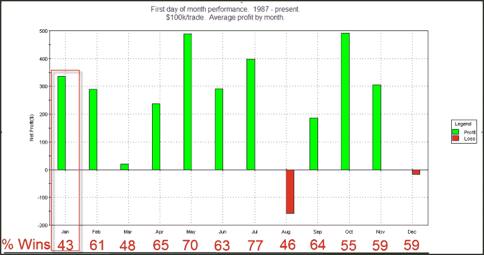

<!--yml
category: 未分类
date: 2024-05-18 13:07:44
-->

# Quantifiable Edges: Why The 1st Day of January Has Been So Interesting

> 来源：[http://quantifiableedges.blogspot.com/2010/01/why-1st-day-of-january-has-been-so.html#0001-01-01](http://quantifiableedges.blogspot.com/2010/01/why-1st-day-of-january-has-been-so.html#0001-01-01)

Back

[in July I did a study](http://quantifiableedges.blogspot.com/2009/07/1st-day-of-month-tendencies.html)

that looked at the upward bias of the 1st day of each month. As you may recall I ran the study back to 1987 because prior to that there was no significant bias on the 1st day of the month. January is interesting because over the last 23 years its had the worst % profitable of any month but still the 4th highest average returns. When New Years optimism runs high it can create a sharp up move. In fact there have been 3 years (1988, 2002, 2009) since 1987 where the S&P 500 has gained over 3% on the 1st day in January. Below is a copy of the table from the July 1, 2009 blog post with breakdowns by month (stats not updated).

