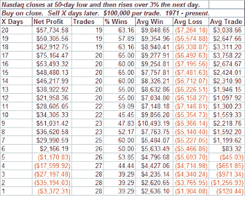

<!--yml
category: 未分类
date: 2024-05-18 08:12:05
-->

# Quantifiable Edges: Will The Bounce Continue?

> 来源：[http://quantifiableedges.blogspot.com/2008/07/will-bounce-continue.html#0001-01-01](http://quantifiableedges.blogspot.com/2008/07/will-bounce-continue.html#0001-01-01)

I received several emails tonight asking my opinion on today’s rally. So below are a few thoughts along with one test.

Recently I showed that

[large moves off bottoms can provide fuel for a further rally](http://quantifiableedges.blogspot.com/2008/07/bounce-not-impressive-so-far.html)

. The real edge didn’t come until the 3% threshold for the S&P 500 was reached. Today’s move of 2.5% may or may not be enough. There isn’t convincing evidence either way based on the above mentioned test.

The Nasdaq did have a 3% day. Below is a table showing other times the Nasdaq rose 3% or more following a 50-day low:

The typical pattern has been a pullback followed by a continuation of the move. Of the 28 trades with a 3-day holding period, 23 of them traded below their entry-day close at some point over the next three days. So if you didn't get long yet, you'll likely have an opportunity in the next three days to pick up some index shares at lower prices if you like.

I’ve shown a few other studies this week which showed a good chance for at least a strong multi-day rally. Currently I expect to see more upside over the next week or so. I’d be surprised if the market just rolled right over to new lows again this time.