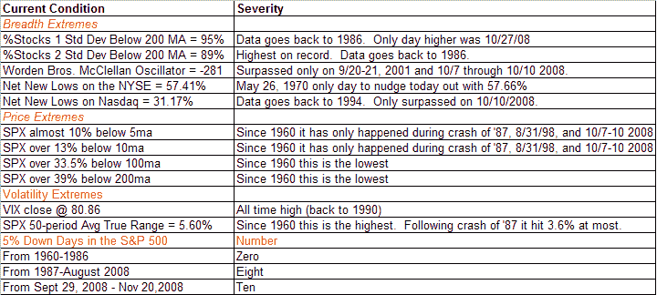

<!--yml
category: 未分类
date: 2024-05-18 13:33:25
-->

# Quantifiable Edges: XXXtreme

> 来源：[http://quantifiableedges.blogspot.com/2008/11/xxxtreme.html#0001-01-01](http://quantifiableedges.blogspot.com/2008/11/xxxtreme.html#0001-01-01)

So every few weeks a new selloff emerges that attempts to one-up the previous selloff. I showed some tables with incredible extreme conditions on

[10/9](http://quantifiableedges.blogspot.com/2008/10/extreme-conditions.html)

and

[10/27](http://quantifiableedges.blogspot.com/2008/10/back-to-extreme.html)

. And now I present…contestant #3.

Also notable is that the CBI popped up to 13 today.

The top 3 breadth stats come from Worden Bros. TC2000.

P.S. Traders may want to take a look at the charts following the previous two extreme posts.