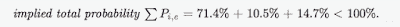

<!--yml
category: 未分类
date: 2024-05-12 18:55:32
-->

# Quantitative Trading: A novel capital booster: Sports Arbitrage

> 来源：[http://epchan.blogspot.com/2018/01/a-novel-capital-booster-sports-arbitrage.html#0001-01-01](http://epchan.blogspot.com/2018/01/a-novel-capital-booster-sports-arbitrage.html#0001-01-01)

By Stephen Hope

As traders, we of course need money to make money, but not everyone has 10-50k of capital lying around to start one's trading journey. Perhaps the starting capital is only 1k or less. This article describes how one can take a small amount of capital and multiply it as much as 10 fold in one year by taking advantage of large market inefficiencies (leading to arbitrage opportunities) in the sports asset class. However, impressive returns such as this are difficult to achieve with significantly larger seed capital, as discussed later.

Arbitrage is the perfect trade if you can get your hands on one, but clearly this is exceptionally difficult in the financial markets. In contrast, the sports markets are very inefficient due to the general lack of trading APIs and patchy liquidity etc. Arbitrages can persist for minutes (or even hours at a time).

Consider a very simple example of sports arbitrage; Team A vs Team B and three bookmakers quoting the odds shown in the table below. When the odds are expressed in decimal form we can calculate the implied probability of the event  e occurring as quoted by bookmaker i as  P(i,e) = 1/Odds(i,e)  (shown in brackets in the table).

|  |  |  | **Bookmaker B3** |
|  |  |  | 1.2 (83.3%) |
|  |  |  | 9.1 (11.0%) |
|  |  |  | 6.8 (14.7%) |

In the Three Way Market, there are only 3 possible outcomes; Team A wins, Team A loses or it's a draw. Therefore the sum of the probabilities of these 3 events should equal 100% (in a fair market). However, we can see that the market is not efficient and the combination of odds shown in red give; 

This is an arbitrage opportunity in the Three Way market with 3 legs;

1_2_X and Odds = (1.4, 9.5, 6.8)

where

1 = Three Way Market (home team to win)

2 = Three Way Market (away team to win)

X = Three Way Market (a draw)

The size of the arbitrage is given by 

and in order to realise this arbitrage we need to bet the following percentage stakes against our notional

The above example is a 'simple' arbitrage. However, the majority of football arbitrage opportunities are 'complex' arbitrages. Complex in the sense that the bet legs are not mutually exclusive and more than one leg can pay out over some overlapping subset of possible outcomes. The calculation then becomes more complex. 

For example, consider the following 3 leg complex arbitrage;

AH2(-0.25)_X1_1 and Odds = (1.69, 2.1, 5.25);

where

X1 = Double Chance Market (home team to win or draw)

1 = Three Way Market (home team to win)

We can construct a payoff matrix to more easily visualise the outcome dependent payoffs of the 3 bet legs.

|  |  |  | **Home Team Wins** |
|  |  |  | -1 |
|  |  |  | 1.1 |
|  |  |  | 4.25 |

Matrix Element Meanings

0.69 –> win 0.69 * stake 1 (+ stake 1 returned)

1.1 –> win 1.1 * stake 2 (+ stake 2 returned)

4.25 –> win 4.25 * stake 3 (+ stake 3 returned)

-0.5 –> lose -0.5 * stake 1 (get half of stake 1 back)

-1 –> lose -1 * stake i (lose your full stake)

The structure of the Payoff Matrix reveals a 'potential' arbitrage because there exists no column (event outcome) that contains only negative cash flows. It is a potential 'complex arbitrage' because in the event of a draw or home team win, there exists two bet legs that can give rise to a positive cash flow for the same outcome (remember, -0.5 means half of the stake is returned so is still positive). However, whether or not the arbitrage can be 'realised' depends on whether or not we can find a solution for the stake percentages for each leg that gives a positive net profit for every outcome. So how do we do this ?

Constructed as a dynamic programming optimisation we have;

where

x = ( x1 , x2 , x3 ... ) are the bet leg stakes

C is a payoff matrix column chosen to maximise

A is the constraints matrix (e.g sum of stakes = 1, stake (i) >= 0 etc)

Solving the optimisation for the AH2(-0.25)_X1_1 example above gives;

|  |  |  |  | **Stake %** |
|  |  |  |  | 60.20% |
|  |  |  |  | 34.10% |
|  |  |  |  | 5.70% |
|  |  |  |  | **100.00%** |

We can see that the arbitrage does indeed have a solution with the stake percentages (60.2%, 34.1%, 5.7%) giving an arbitrage of 1.7% for every possible outcome. There are many thousands of these arbitrage opportunities appearing each day in the sports markets ranging in size from 0.1% - 7%+.

What returns are possible? Consider, starting with a seed capital of £1k and a trading frequency of 3 times per week with an average arbitrage size of 1.6%. Initially we compound our winnings but there are limits to how much you can stake with a given bookmaker. Assume that we cannot increase our notional beyond £5000 across any multi-leg arbitrage trade. In that case, the initial £1k can grow to approximately £9,500 in one year. Not bad for a few minutes of effort per trade. 

So what's the catch? 

There are really only two pitfalls. 

1)  Scaling: You cannot easily compound your returns as with the financial markets.

2) Limit Risk: Bookmakers don't want you to win and can be inclined to significantly reduce your allowed stake notional if you win too much. Avoiding this requires careful management.

Although sports arbitrage does not easily scale, it is a great way of boosting trading capital by a few thousand pounds per year with very small time effort; capital which could be put to use in the financial or crypto markets.

===

*About the author*

: Stephen Hope is Co-Founder of Machina Trading, a proprietary crypto & sports trading firm that provides an arbitrage tool called

[rational bet](https://www.rational.bet/affiliate-redirect/02da18ac-5333-4e87-ade8-1044645ba7fd)

. He is former Head of Quantitative Trading Strategies at BNP Paribas and received his PhD in Physics from the University of Cambridge.

===

**Upcoming Workshops by Dr. Ernie Chan**

This online course focuses on backtesting intraday and portfolio option strategies. No pesky options pricing theories will be discussed, as the emphasis is on arbitrage trading.

These intense 8-16 hours workshops cover Algorithmic Options Strategies, Quantitative Momentum Strategies, and Intraday Trading and Market Microstructure. Typical class size is under 10\. They may qualify for CFA Institute continuing education credits.