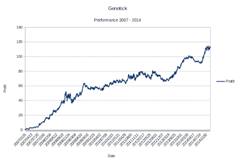

<!--yml
category: 未分类
date: 2024-05-12 18:56:45
-->

# Quantitative Trading: An open-source genetic algorithm software (Guest post)

> 来源：[http://epchan.blogspot.com/2015/10/an-open-source-genetic-algorithm.html#0001-01-01](http://epchan.blogspot.com/2015/10/an-open-source-genetic-algorithm.html#0001-01-01)

*By Lukasz Wojtow*

Mechanical traders never stop researching for the next market edge. Not only to get better results but also to have more than one system. The best trading results can be achieved with multiple non-correlated systems traded simultaneously. Unfortunately, most traders use similar market inefficiency: some traders specialize in trend following, some in mean reversion and so on. That's because learning to exploit one kind of edge is hard enough, mastering all of them – impossible. It would be beneficial to have a software that creates many non-related systems.

Recently I released Genotick - an open source software that can create and manage a group of trading systems. At the Genotick's core lies an epiphany: if it's possible to create any software with just a handful of assembler instructions, it should be possible to create any trading systems with a handful of similarly simple instructions. These simple and meaningless-on-its-own instructions become extremely powerful when combined together. Right instructions in the right order can create any type of mechanical system: trend following, mean reverting or even based on fundamental data.

The driving engine behind Genotick's power is a genetic algorithm. Current implementation is quite basic, but with some extra quirks. For example, if any of the systems is really bad – it stays in the population but its predictions are reversed. Another trick is used to help recognize biased trading systems: a system can be removed if it doesn't give mirrored prediction on mirrored data. So for example, position on GBP/USD must be opposite to the one on USD/GBP. Genotick also supports optional elitism (where the best systems always stay in the population, while others are retired due to old age), protection for new systems (to avoid removing systems that didn't yet have a chance to prove themselves) and inheriting initial system's weight from parents. These options give users plenty of room for experimentation.

When Genotick is run for the first time - there are no systems. They are created at the start using randomly chosen instructions. Then, a genetic algorithm takes over: each system is executed to check its prediction on historical data. Systems that predicted correctly gain weight for future predictions, systems that predicted incorrectly – lose weight. Gradually, day after day, population of systems grows. Bad systems are removed and good systems breed. Prediction for each day is calculated by adding predictions of all systems available at the time. Genotick doesn't iterate over the same historical data more than once – training process looks exactly as if it was executed in real life: one day at a time. In fact, there is no separate “training” phase, program learns a little bit as each day passes by.

Interestingly, Genotick doesn't check for rationale behind created systems. As each system is created out of random instructions, it's possible (and actually very likely) that some systems use ridiculous logic. For example, it's possible that a system will give a “Buy” signal if Volume was positive 42 days ago. Another system may want to go short each time the third digit in yesterday's High is the same as second digit in today's Open. Of course, such systems would never survive in real world and also they wouldn't survive for long in Genotick's population. Because each system's initial weight is zero, they never gain any significant weight and therefore don't spoil cumulative prediction given by the program. It may seem a little silly to allow such systems in the first place, but it enables Genotick to test algorithms that are free from traders' believes, misguided opinions and personal limitations. The sad fact is, the market doesn't care about what system you use and how much sweat and tears you put into it. Market is going to do what it wants to do – no questions asked, not taking prisoners. Market doesn't even care if you use any sort of intelligence, artificial or not. And so, the only rationale behind every trading system should be very simple: “Does it work?”. Nothing more, nothing less. This is the only metric Genotick uses to gauge systems.

Each program's run will be a little bit different. Equity chart below shows one possible performance. Years shown are 2007 until 2015 with actual training starting in 2000\. There is nothing special about year 2007, remember – Genotick learns as it goes along. However, I felt it's important to look how it performed during financial crisis. Markets traded were:

USD/CHF, USD/JPY, 10 Year US Bond Yield, SPX, EUR/USD, GBP/USD and Gold.

(In some cases, I tested the system on a market index such as SPX instead of an instrument that tracks the index such as SPY, but the difference should be minor.)  All markets were mirrored to allow removing biased systems. Some vital numbers:

CAGR: 9.88%

Maxim drawdown: -21.6%

Longest drawdown: 287 trading days

Profitable days: 53.3 %

CALMAR ratio: 0.644

Sharpe ratio: 1.06

Mean annual gain: 24.1%

Losing year: 2013 (-12%)

(Click the cumulative returns in % chart below to enlarge.)

|  |
| Cumulative Returns (%) since 2007 |

These numbers represent only “directional edge” offered by the software. There were no stop-losses, no leverage and no position sizing, which could greatly improve real life results. The performance assumes that at the end of each day, the positions are rebalanced so that each instrument starts with equal dollar value. (I.e. this is a constant rebalanced portfolio.)

Artificial Intelligence is a hot topic. Self driving cars that drive better than an average human and chess algorithms that beat an average player are facts. The difference is that using AI for trading is perfectly legal and opponents may never know. Unlike chess and driving, there is a lot of randomness in financial markets and it may take us longer to notice when AI starts winning. Best hedge funds can be still run by humans but if any trading method is really superior, AI will figure it out as well.

At the moment Genotick is more of a proof-of-concept rather than production-ready.

It is very limited in usability, it doesn't forgive mistakes and it's best to ask before using it for real trading. You will need Java 7 to run it. It's tested on both Linux and Windows 10\. Example historical data is included. Any questions or comments are welcomed.

===

**My Upcoming Workshop**

Momentum strategies have performed superbly in the recent market turmoil, since they are long volatility. This course will cover momentum strategies on a variety of asset classes and with a range of trading horizons.

====

Follow me on Twitter: @chanep