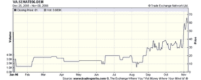
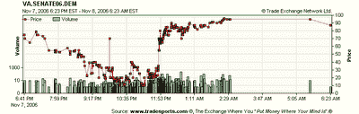

<!--yml
category: 未分类
date: 2024-05-12 19:27:46
-->

# Quantitative Trading: Are political futures markets really predictive?

> 来源：[http://epchan.blogspot.com/2006/11/is-political-futures-markets-really.html#0001-01-01](http://epchan.blogspot.com/2006/11/is-political-futures-markets-really.html#0001-01-01)

Today I will take a brief break from quantitative trading in the financial markets. Instead, I will take a critical look at

[political futures markets](http://msnbc.msn.com/id/15594121/site/newsweek/)

. There has been a lot of enthusiasm lately for such markets (e.g.

[www.tradesports.com](http://www.tradesports.com)

, based in Ireland, is the most popular one.) Media pundits and scholars alike have often said that these markets offer a better prediction of election outcomes than opinion polls, sometimes claiming that they beat polls three-quarters of the time. I have been an avid participant in these markets, but I would like to offer a contrarian view: I believe that these markets often follow, rather than predict, events. The so-called “predictability” of these markets is often ill-defined. The prediction changes constantly over time, and so depending on when you take a snapshot of the markets, you can always find an instant when, retrospectively, the prediction matches the actual election outcomes very closely.

As an example, I watched with amusement the tradesports.com futures market prediction of the Virginia Senate race between Democrat Jim Webb and Republican George Allen. This is one of the two close races that will determine the control of the Senate. For months, the market predicts that the Democrat will lose (the probability of winning, which is the same as the price divided by 100, is always below 50% until the beginning of November). Then in November, the market began to see the light, and started to predict a Democratic win. See the chart below.

But look what happened on the night of the election:

As the vote counts started to be released, the market first thought the Republican was going to win, driving the prices down to the teens. That was due to the votes from the conservative southern Virginia, which were the first to come in. Then, as the vote counts from the more liberal northern Virginia were published at around 11:30 pm, the prices shot up to above $60, and continued on to over $80\. Clearly, the market does not know more about the future than your average news anchor.

As someone interested in the predictability of election outcomes based on futures markets, this raises a serious question. What is the proper time to take a snapshot of the market? Should it be 1 month before the election (in which case this market prediction failed, presuming a Democratic win after the recount)? Or should it be 1 week before the election, in which case this market prediction succeeded? And without an answer to this question, how can one claim whether the prediction is accurate or inaccurate?