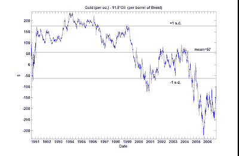

<!--yml
category: 未分类
date: 2024-05-12 19:24:55
-->

# Quantitative Trading: Do Gold and Oil Cointegrate?

> 来源：[http://epchan.blogspot.com/2007/02/i-have-written-extensively-here-about_15.html#0001-01-01](http://epchan.blogspot.com/2007/02/i-have-written-extensively-here-about_15.html#0001-01-01)

I have written extensively here about cointegration between gold-miners and gold ETF's (GDX vs GLD), as well as between energy companies and oil ETF's (XLE vs USO). (See, for e.g.,

[this article](http://epchan.blogspot.com/2006/11/updated-analysis-of-arbitrage-between.html "this article")

, or

[this article](http://epchan.blogspot.com/2006/11/extended-analysis-of-energy-futures-and.html "this article")

.) On another occasion, I also

[commented](http://epchan.blogspot.com/2007/02/cointegration-between-oil-and-bond.html "commented")

on an Economist magazine article about the possible cointegration between bond yield and oil prices. However, my fellow blogger

[Yaser](http://equityinvestmentideas.blogspot.com/ "Yaser")

recently pointed out an interesting link between gold and oil also. The reasons why gold and oil may be cointegrated are very similar to that of bond yield and oil: as oil price rise a) the oil revenue is invested heavily in gold, therefore pushing up gold price; b) there is an upward pressure on inflation, which increases the appeal of gold as an inflation hedge.

I did a cointegration analysis between gold and oil prices, and though their spread certainly looks somewhat mean-reverting since the 90's, it doesn't pass the cointegration test. The reason may simply be that this spread mean-reverts at a glacial pace: I estimate that the half-life (see my explanation of this term

[here](http://epchan.blogspot.com/2007/01/what-is-your-stop-loss-strategy.html "here")

) is over 14 months. Therefore, it may require historical data back to the 1970's to convince ourselves of their cointegration. (My own data on crude oil and gold prices only go as far back as the 1990's. If any reader knows of historical data source that goes back further, please let me know.) If, however, one is willing to take their cointegration by faith despite the inadequate data, then one may believe that gold is currently (as of Feb 12, 2007) just slightly undervalued relative to oil (the spread is about $8). I certainly don't recommend entering into a position on either side at this point!

 