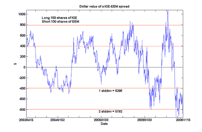

<!--yml
category: 未分类
date: 2024-05-12 19:26:24
-->

# Quantitative Trading: Does Canada belong to the Emerging Markets?

> 来源：[http://epchan.blogspot.com/2006/11/does-canada-belong-to-emerging-markets.html#0001-01-01](http://epchan.blogspot.com/2006/11/does-canada-belong-to-emerging-markets.html#0001-01-01)

Many of us Canadians like to think of our economy as a member of the advanced, post-industrial world, with the landscape dotted with brand-name companies such as Nortel Networks, Research In Motion, and Four Seasons Hotels. In the back of our minds, of course, we know we are also a resource-rich country. But still, it may come as a bit of an embarrassment to find out that, of all the sector index funds we can compare the MSCI Canada Index fund EWC to, it cointegrates only with the natural resource index fund IGE. Even the financial sector indices do not come close, despite the presence of numerous financial services companies in the Canada Index. As usual, in the chart below, I plotted the spread between 100 shares of IGE and 400 shares of EWC, and we can see for ourselves how this spread stubbornly sticks close to zero.

One may note that IGE also cointegrates with the Emerging Markets index fund EEM. (The chart below is the spread between 100 shares of IGE and 100 shares of EEM.)

This is not surprising. But does this imply the unsettling conclusion that the Canadian economy cointegrates with the emerging markets? No. I will not bore you with yet another chart: just be assured that cointegration is not a transitive relation.