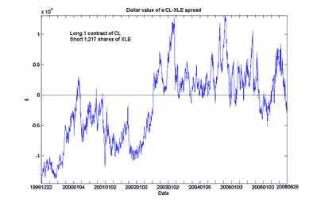

<!--yml
category: 未分类
date: 2024-05-12 19:26:50
-->

# Quantitative Trading: Extended analysis of energy futures and stocks arbitrage

> 来源：[http://epchan.blogspot.com/2006/11/extended-analysis-of-energy-futures-and.html#0001-01-01](http://epchan.blogspot.com/2006/11/extended-analysis-of-energy-futures-and.html#0001-01-01)

A reader of my article “

[An arbitrage trade between energy stocks and futures](http://epchan.blogspot.com/2006/10/arbitrage-trade-between-energy-stocks.html)

” suggested that I should look at a longer history of crude oil prices vs. XLE. So I performed the same cointegration analysis for the front-month crude oil futures contract CL vs. XLE since December 1998\. (I use CL instead of QM, the mini crude oil contract, due to its longer history.) Here is the plot of the dollar value of long 1 contract of CL and short 1,217 shares of XLE. (My previous analysis called for 1 contract of QM vs. 640 shares of XLE. The difference in shares is due to the half-size of QM relative to CL, and also to the larger dataset here.)

An interesting feature emerged from this extended analysis. CL and XLE are still found to be cointegrated over this long period, albeit with a slightly lower probability (90%). However, we can see something of a regime shift around mid-2002, when CL went from generally under-valued to over-valued relative to XLE. (Even after including this regime with lower relative crude oil prices in my calculations, I still find the current spread to be undervalued by about $10,521 as of the close of Nov 17, which is near its 6-year low.)

What was the reason for this apparent shift in mid-2002? And are we in the middle of a similar regime shift in the opposite direction? Maybe our readers who have a better grasp of the economic fundamentals of the energy markets can shed light on this.