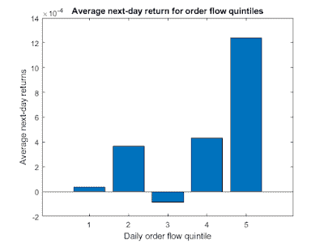

<!--yml
category: 未分类
date: 2024-05-12 18:55:24
-->

# Quantitative Trading: FX Order Flow as a Predictor

> 来源：[http://epchan.blogspot.com/2018/02/fx-order-flow-as-predictor.html#0001-01-01](http://epchan.blogspot.com/2018/02/fx-order-flow-as-predictor.html#0001-01-01)

Order flow is signed trade size, and it has long been known to be predictive of future price changes. (See

[Lyons, 2001](http://amzn.to/2DKKn8j)

, or

[Chan, 2017](https://www.amazon.com/Machine-Trading-Deploying-Computer-Algorithms/dp/1119219604/ref=as_sl_pc_tf_til?tag=quantitativet-20&linkCode=w00&linkId=b6c22e03b04fdcf3f6a14bc4b5891edb&creativeASIN=1119219604)

.) The problem, however, is that it is often quite difficult or expensive to obtain such data, whether historical or live. This is especially true for foreign exchange transactions which occur over-the-counter. Recognizing the profit potential of such data, most FX market operators guard them as their crown jewels, never to be revealed to customers. But recently FXCM, a FX broker, has kindly provided me with their

[proprietary data](https://www.fxcm.com/uk/trading-services/market-data/)

, and I have made use of that to test a simple trading strategy using order flow on EURUSD.

First, let us examine some general characteristics of the data. It captures all trades transacted on FXCM occurring in 2017, time stamped in milliseconds, and with their trade prices and signed trade sizes. The sign of a trade is positive if it is the result of a buy market order, and negative if it is the result of a sell. If we take the absolute value of these trade sizes and sum them over hourly intervals, we obtain the usual hourly volumes (click to enlarge) aggregated over the 1 year data set:

It is not surprising that the highest volume occurs between 16:00-17:00 London time, as 16:00 is when the benchmark rate (the "

[fix](https://www.investopedia.com/articles/forex/031714/how-forex-fix-may-be-rigged.asp)

") is determined. The secondary peak at 9:00-10:00 is of course the start of the business day in London.

Next, I compute the daily total order flow of EURUSD (with the end of day at New York's midnight), and I establish a histogram of the last 20 days' daily order flow. I then determine the average next-day return of each daily order flow quintile. (I.e. I bin a next-day return based on which quintile the prior day's order flow fell into, and then take the average of the returns in each bin.) The result is satisfying:

We can see that the average next-day returns are almost monotonically increasing with the previous day's order flow. The spread between the top and bottom quintiles is about 12 bps, which annualizes to about 30%. This doesn't mean we will generate 30% annualized returns, since we won't be able to arbitrage between today's return (if the order flow is in the top or bottom quintile) with some previous day's return when its order flow was in the opposite extreme. Nevertheless, it is encouraging. Also, this is an illustration that even though order flow must be computed on a tick-by-tick basis (I am not a fan of the

[bulk volume classification](https://papers.ssrn.com/sol3/papers.cfm?abstract_id=2182819)

technique), it can be used in low-frequency trading strategies.

(One may be tempted to also regress future returns against past order flows, but the result is statistically insignificant. Apparently only the top and bottom quintiles of order flow are predictive. This situation is actually quite

[common](https://www.bloomberg.com/news/articles/2017-06-27/ex-bridgewater-quant-says-smart-beta-etfs-use-factors-all-wrong)

in finance, which is why linear regression isn't used more often in trading strategies.)

Finally, one more sanity check before backtesting. I want to see if the buy trades (trades resulting from buy market orders) are filled above the bid price, and the sell trades are filled below the ask price. Here is the plot for one day (times are in New York):

We can see that by and large, the relationship between trade and quote prices is satisfied. We can't really expect that this relationship holds 100%, due to rare occasions that the quote has moved in the sub-millisecond after the trade occurred and the change is reported as synchronous with the trade, or when there is a delay in the reporting of either a trade or a quote change.

So now we are ready to construct a simple trading strategy that uses order flow as a predictor. We can simply buy EURUSD at the end of day when the daily flow is in the top quintile among its last 20 days' values, and hold for one day, and short it when it is in the bottom quintile. Since our daily flow was measured at midnight New York time, we also define the end of day at that time. (Similar results are obtained if we use London or Zurich's midnight, which suggests we can stagger our positions.) In my backtest, I have subtracted 0.20 bps commissions (based on Interactive Brokers), and I assume I buy at the ask and sell at the bid using market orders. The equity curve is shown below:

The CAGR is 13.7%, with a Sharpe ratio of 1.6\. Not bad for a single factor model!

*Acknowledgement*

:  I thank 

[Zachary David](http://zacharydavid.com/)

 for his review and comments on an earlier draft of this post, and of course FXCM for providing their

[data](https://www.fxcm.com/uk/trading-services/market-data/)

 for this research.

===

Industry update

1) 

[Qcaid](http://www.qbitia.com/)

is a cloud-based platform that provides traders with backtesting, execution, and simulation facilities. They also provide servers and data feed.

2) 

[How Cadre Uses Machine Learning to Target Real Estate Markets](https://blog.cadre.com/how-cadre-uses-machine-learning-to-target-real-estate-markets-3c03ca1dac26)

.

3) Check out Quantopian's new

[tutorial](https://www.quantopian.com/tutorials/getting-started)

 on getting started in quantitative finance.

4) A new Matlab-based backtest and live trading platform for download 

[here](https://github.com/EliteQuant/EliteQuant_Matlab)

.

5) A nice resource page for open source algorithmic trading tools at

[QuantNews](http://www.quantnews.com/resources/)

.

**My Upcoming Workshops**

February 24 and March 3:

[Algorithmic Options Strategies](http://www.epchan.com/workshops)

This online course focuses on backtesting intraday and portfolio option strategies. No pesky options pricing theories will be discussed, as the emphasis is on arbitrage trading.

June 4-8: London workshops

These intense 8-16 hours workshops cover

[Algorithmic Options Strategies](http://www.globalmarkets-training.co.uk/algorithmicoptions.html)

,

[Quantitative Momentum Strategies](http://www.globalmarkets-training.co.uk/quantmomentum.html)

, and

[Intraday Trading and Market Microstructure](http://www.globalmarkets-training.co.uk/intradaytrading.html)

. Typical class size is under 10\. They may qualify for CFA Institute continuing education credits. (Bonus: nice

[view](https://twitter.com/chanep/status/908250965786144769)

of the Thames, and lots of free food.)