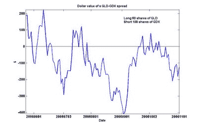

<!--yml
category: 未分类
date: 2024-05-12 19:28:06
-->

# Quantitative Trading: Gold vs. gold-miners: another arbitrage opportunity?

> 来源：[http://epchan.blogspot.com/2006/11/gold-vs-gold-miners-another-arbitrage.html#0001-01-01](http://epchan.blogspot.com/2006/11/gold-vs-gold-miners-another-arbitrage.html#0001-01-01)

Recently there is mounting interest in buying gold (for example, see this

[report](http://www.thestreet.com/_yahoo/markets/commodities/10319196.html)

at TheStreet.com). I am not much of a fundamental analyst, so I won’t go into the economic reasons whether to own or not own gold now. Rather, I would like to see if there is an arbitrage opportunity here in the midst of all this excitement.

I talked about

[before](http://epchan.blogspot.com/2006/10/arbitrage-trade-between-energy-stocks.html)

why I believe energy futures and energy companies ETF are “cointegrated”, i.e. when their spread wanders far from a mean value, there is a high probability that they will revert to the mean. The same analysis can be made about other pairs of commodity futures and ETF’s. Therefore I apply this to gold.

Looking around for ETF’s that hold gold miners, I found GDX. It started trading on May 23, 2006 and therefore has a relatively short history for us to analyze. We could have paired it against the front-month gold futures contract GC, but this may be inconvenient because one has to rollover the contracts monthly. So instead, we pair it against an ETF that holds gold as a commodity. GLD is one such example. (So is IAU, but GLD is far more liquid.) Using the same Matlab cointegration package that I mentioned in the previous article, I determine that even with the short history, GLD cointegrates with GDX with a 90% probability. Also, the package tells us the proper combination is 60 shares of GLD vs. 100 shares of GDX. So if we form a pair by buying 60 shares of GLD and shorting 100 shares of GDX, we can plot the value over time here:

There were indeed numerous instances of reversion to the mean. I was able to take advantage of the high around mid-July and shorted this spread profitably, and I also bought the spread around the low in early September and exited my positions profitably around mid-September. As of the 1st of November, the spread is once again in sufficiently negative territory to warrant attention.

There are some caveats with trading this spread. First, it is not always easy to borrow GDX or GLD to short. It depends on if your broker has a good securities lending desk. Secondly, the history of GDX is short. So any analysis must be taken with a grain of salt. To overcome this short history, I could have constructed my own basket of gold mining stocks and plot the price of this basket against the gold futures GC. If you intend to invest heavily into this spread, I would definitely recommend doing this piece of hard work.