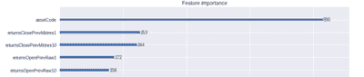
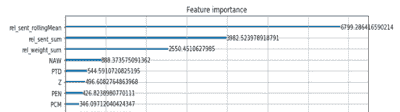

<!--yml
category: 未分类
date: 2024-05-12 18:55:05
-->

# Quantitative Trading: Is News Sentiment Still Adding Alpha?

> 来源：[http://epchan.blogspot.com/2019/04/is-news-sentiment-still-adding-alpha.html#0001-01-01](http://epchan.blogspot.com/2019/04/is-news-sentiment-still-adding-alpha.html#0001-01-01)

By Ernest Chan and

[Roger Hunter](http://www.qtscm.com/principals/)

Nowadays it is nearly impossible to step into a quant trading conference without being bombarded with flyers from data vendors and panel discussions on news sentiment. Our team at QTS has made a vigorous effort in the past trying to extract value from such data, with indifferent results. But the central quandary of testing pre-processed alternative data is this: is the null result due to the lack of alpha in such data, or is the data pre-processing by the vendor faulty? We, like many quants, do not have the time to build a natural language processing engine ourselves to turn raw news stories into sentiment and relevance scores (though NLP was the specialty of one of us back in the day), and we rely on the data vendor to do the job for us. The fact that we couldn't extract much alpha from one such vendor does not mean news sentiment is in general useless.

So it was with some excitement that we heard Two Sigma, the $42B+ hedge fund, was sponsoring a

[news sentiment competition at Kaggle](https://www.kaggle.com/c/two-sigma-financial-news)

, providing free sentiment data from Thomson-Reuters for testing. That data started from 2007 and covers about 2,000 US stocks (those with daily trading dollar volume of roughly $1M or more), and complemented with price and volume of those stocks provided by Intrinio. Finally, we get to look for alpha from an industry-leading source of news sentiment data!

The evaluation criterion of the competition is effectively the Sharpe ratio of a user-constructed market-neutral portfolio of stock positions held over 10 days.  (By market-neutral, we mean zero beta. Though that isn't the way Two Sigma put it, it can be shown

[statistically](http://www.kaggle.com/marketneutral/eda-what-does-mktres-mean)

and mathematically that their criterion is equivalent to our statement.) This is conveniently the Sharpe ratio of the "alpha", or excess returns, of a trading strategy using news sentiment.

It may seem straightforward to devise a simple trading strategy to test for alpha with pre-processed news sentiment scores, but Kaggle and Two Sigma together made it unusually cumbersome and time-consuming to conduct this research. Here are some  common complaints from Kagglers, and we experienced the pain of all of them:

1.  As no one is allowed to download the precious news data to their own computers for analysis, research can only be conducted via Jupyter Notebook run on Kaggle's servers. As anyone who has tried Jupyter Notebook knows, it is a great real-time collaborative and presentation platform, but a very unwieldy debugging platform
2.  Not only is Jupyter Notebook a sub-optimal tool for efficient research and software development, we are only allowed to use 4 CPU's and a very limited amount of memory for the research. GPU access is blocked, so good luck running your deep learning models. Even simple data pre-processing killed our kernels (due to memory problems) so many times that our hair was thinning by the time we were done.
3.  Kaggle kills a kernel if left idle for a few hours. Good luck training a machine learning model overnight and not getting up at 3 a.m. to save the results just in time.
4.  You cannot upload any supplementary data to the kernel. Forget about using your favorite market index as input, or hedging your portfolio with your favorite ETP.
5.  There is no "securities master database" for specifying a unique identifier for each company and linking the news data with the price data.

The last point requires some elaboration. The price data uses two identifiers for a company, assetCode and assetName, neither of which can be used as its unique identifier. One assetName such as Alphabet can map to multiple assetCodes such as GOOG.O and GOOGL.O. We need to keep track of GOOG.O and GOOGL.O separately because they have different price histories. This presents difficulties that are not present in industrial-strength databases such as CRSP, and requires us to devise our own algorithm to create a unique identifier. We did it by finding out for each assetName whether the histories of its multiple assetCodes overlapped in time. If so, we treated each assetCode as a different unique identifier. If not, then we just used the last known assetCode as the unique identifier. In the latter case, we also checked that “joining” the multiple assetCodes made sense by checking that the gap between the end of one and the start of the other was small, and that the prices made sense. With only around 150 cases, these could all be checked externally. On the other hand, the news data has only assetName as the unique identifier, as presumably different classes of stocks such as GOOG.O and GOOGL.O are affected by the same news on Alphabet. So each news item is potentially mapped to multiple price histories.

The price data is also quite noisy, and Kagglers spent much time replacing bad data with good ones from outside sources. (As noted above, this can't be done algorithmically as data can neither be downloaded nor uploaded to the kernel. The time-consuming manual process of correcting the bad data seemed designed to torture participants.) It is harder to determine whether the news data contained bad data, but at the very least, time series plots of the statistics of some of the important news sentiment features revealed no structural breaks (unlike those of another vendor we tested previously.) 

To avoid overfitting, we first tried the two most obvious numerical news features: Sentiment and Relevance. The former ranges from -1 to 1 and the latter from 0 to 1 for each news item. The simplest and most sensible way to combine them into a single feature is to multiply them together. But since there can be many news item for a stock per day, and we are only making a prediction once a day, we need some way to aggregate this feature over one or more days. We compute a simple moving average of this feature over the last 5 days (5 is the only parameter of this model, optimized over training data from 20070101 to 20141231). Finally, the predictive model is also as simple as we can imagine: if the moving average is positive, buy the stock, and short it if it is negative. The capital allocation across all trading signals is uniform. As we mentioned above, the evaluation criterion of this competition means that we have to enter into such positions at the market open on day t+1 after all the news sentiment data for day t was known by midnight (in UTC time zone). The position has to be held for 10 trading days, and exit at the market open on day t+11, and any net beta of the portfolio has to be hedged with the appropriate amount of the market index. The alpha on the validation set from 20150101 to 20161231 is about 2.3% p.a., with an encouraging Sharpe ratio of 1\. The alpha on the out-of-sample test set from 20170101 to 20180731 is a bit lower at 1.8% p.a., with a Sharpe ratio of 0.75\. You might think that this is just a small decrease, until you take a look at their respective equity curves:

One cliché in data science confirmed: a picture is worth a thousand words. (Perhaps you’ve heard of the

[Anscombe's Quartet](https://en.wikipedia.org/wiki/Anscombe%27s_quartet)

?) We would happily invest in a strategy that looked like that in the validation set, but no way would we do so for that in the test set. What kind of overfitting have we done for the validation set that caused so much "variance" (in the bias-variance sense) in the test set? The honest answer is: Nothing. As we discussed above, the strategy was specified based only on the train set, and the only parameter (5) was also optimized purely on that data. The validation set is effectively an out-of-sample test set, no different from the "test set". We made the distinction between validation vs test sets in this case in anticipation of machine learning hyperparameter optimization, which wasn't actually used for this simple news strategy.  

We will comment more on this deterioration in performance for the test set later. For now, let’s address another question: Can categorical features improve the performance in the validation set? We start with 2 categorical features that are most abundantly populated across all news items and most intuitively important: headlineTag and audiences. 

The headlineTag feature is a single token (e.g. "BUZZ"), and there are 163 unique tokens. The audiences feature is a set of tokens (e.g. {'O', 'OIL', 'Z'}), and there are 191 unique tokens. The most natural way to deal with such categorical features is to use "one-hot-encoding": each of these tokens will get its own column in the feature matrix, and if a news item contains such a token, the corresponding column will get a "True" value (otherwise it is "False"). One-hot-encoding also allows us to aggregate these features over multiple news items over some lookback period. To do that, we decided to use the OR operator to aggregate them over the most recent trading day (instead of the 5-day lookback for numerical features). I.e. as long as one news item contains a token within the most recent day, we will set that daily feature to True. Before trying to build a predictive model using this feature matrix, we compared their features importance to other existing features using boosted random forest, as implemented in LightGBM. 

These categorical features are nowhere to be found in the top 5 features compared to the price features (returns). But more shockingly, LightGBM returned assetCode as the most important feature! That is a common fallacy of using train data for feature importance ranking (the problem is highlighted by

[Larkin](https://www.kaggle.com/marketneutral/the-fallacy-of-encoding-assetcode)

.) If a classifier knows that GOOG had a great Sharpe ratio in-sample, of course it is going to predict GOOG to have positive residual return no matter what! The proper way to compute feature importance is to apply

[Mean Decrease Accuracy](https://www.amazon.com/Advances-Financial-Machine-Learning-Marcos/dp/1119482089/ref=as_sl_pc_tf_til?tag=quantitativet-20&linkCode=w00&linkId=d7381a1bc4fd7adf25c210b2967e15be&creativeASIN=1119482089)

(MDA) using validation data or with cross-validation (see our

[kernel](http://www.kaggle.com/chanep/assetcode-with-mda-using-random-data)

demonstrating that assetCode is no longer an important feature once we do that.) Alternatively, we can manually exclude such features that remain constant through the history of a stock from features importance ranking. Once we have done that, we find the most important features are

Compared to the price features, these categorical news features are much less important, and we find that adding them to the simple news strategy above does not improve performance.

So let's return to the question of why it is that our simple news strategy suffered such deterioration of performance going from validation to test set. (We should note that it isn’t just us that were unable to extract much value from the news data. Most other kernels published by other Kagglers have not shown any benefits in incorporating news features in generating alpha either. Complicated price features with complicated machine learning algorithms are used by many leading contestants that have published their kernels.) We have already ruled out overfitting, since there is no additional information extracted from the validation set. The other possibilities are bad luck, regime change, or alpha decay.  Comparing the two equity curves, bad luck seems an unlikely explanation. Given that the strategy uses news features only, and not macroeconomic, price or market structure features, regime change also seems unlikely. Alpha decay seems a likely culprit - by that we mean the decay of alpha due to competition from other traders who use the same features to generate signals. A recently published academic paper (

[Beckers, 2018](https://jpm.iijournals.com/content/45/2/58)

) lends support to this conjecture. Based on a meta-study of most published strategies using news sentiment data, the author found that such strategies generated an information ratio of 0.76 from 2003 to 2007, but only 0.25 from 2008-2017, a drop of 66%!

Does that mean we should abandon news sentiment as a feature? Not necessarily. Our predictive horizon is constrained to be 10 days. Certainly one should test other horizons if such data is available. When we gave a summary of our findings at a conference, a member of the audience suggested that news sentiment can still be useful if we are careful in choosing which country (India?), or which sector (defence-related stocks?), or which market cap (penny stocks?) we apply it to. We have only applied the research to US stocks in the top 2,000 of market cap, due to the restrictions imposed by Two Sigma, but there is no reason you have to abide by those restrictions in your own news sentiment research.

----

**Workshop update:**

We have launched a new online course "Lifecycle of Trading Strategy Development with Machine Learning." This is a 12-hour, in-depth, online workshop focusing on the challenges and nuances of working with financial data and applying machine learning to generate trading strategies. We will walk you through the complete lifecycle of trading strategies creation and improvement using machine learning, including automated execution, with unique insights and commentaries from our own research and practice. We will make extensive use of Python packages such as Pandas, Scikit-learn, LightGBM, and execution platforms like QuantConnect. It will be co-taught by Dr. Ernest Chan and Dr. Roger Hunter, principals of QTS Capital Management, LLC. See

[www.epchan.com/workshops](http://www.epchan.com/workshops)

for registration details.