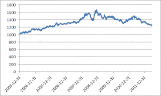

<!--yml
category: 未分类
date: 2024-05-12 19:00:40
-->

# Quantitative Trading: Momentum strategies: a book review

> 来源：[http://epchan.blogspot.com/2012/06/momentum-strategies-book-review.html#0001-01-01](http://epchan.blogspot.com/2012/06/momentum-strategies-book-review.html#0001-01-01)

As a devout mean-reversion trader, I find Mike Dever's new book "

[Jackass Investing](http://www.amazon.com/gp/product/0983504016/ref=as_li_tf_tl?ie=UTF8&tag=quantitativet-20&linkCode=as2&camp=1789&creative=9325&creativeASIN=0983504016)

" unexpectedly well-argued and readable.

You see,

 momentum and mean-reversion traders live in two separate universes, and they are often mutually incomprehensible to each other. Dever, as a CTA, inhabits the momentum universe. Example: my favorite performance measure, the Sharpe ratio, has been brusquely dispatched as a bad measurement of risk, and drawdown becomes king. But all for good reasons: Dever argues that Sharpe ratio measures only the daily volatility of returns, but disregarded the "black swan" events, which are much better captured by the maximum drawdown. I agree with the author on this point, but there are other uses of Sharpe ratio: a high Sharpe ratio strategy does indicate high statistical significance of the trading strategy, a claim that momentum strategies can seldom make. I often think of momentum strategies as being long options: you have to keep paying premium until one day, you make them all back with a home run. But when you are backtesting a strategy, how would you know that the rare, statistically insignificant, home run was not due to data snooping bias? Unless of course, like the author, you have fundamental insights into the traded instruments.  Fundamental insights are in fact one of the delicious highlights of this book. Dever describes his orange juice futures strategy using the "marginal cost of production" as a fundamental valuation tool. He argues that orange juice cannot be sold below this cost, since farmers would have no incentive for production otherwise. And he was right: orange juice futures started to rebound from the 27-year low of 55 cents/pound in May 2004, to almost 90 cents/pound in September (thanks partly to hurricanes hitting Florida). Dever went long at 70 cents. Oh, how we quantitative traders would love to have the confidence that such insights inspire!  Of course, I don't agree with everything written in the book. For example, though the author rightly pointed out that the distribution of returns often have a positive kurtosis, he uses that as evidence of trending behavior. While I agree that price trends can indeed produce positive kurtosis, we can certainly construct mean-reverting price series with occasional catastrophes that have the same kurtosis. To us mean-reversion traders, positive kurtosis is not an invitation to "follow-the-trend", but as a warning sign to find risk management measures that protect us from catastrophes. 

Even though momentum strategies in general are in a state of trauma right now (more on that later), Dever nevertheless makes a good case why we should include them as part of our portfolio of strategies. Comparing the S&P500 index (SPX) with the S&P Diversifed Trends Indicator (DTI, a simple trend-following strategies on 24 futures), he finds that the Sharpe ratio (though of course he refuses to use that hated term) of the DTI is more than double that of the SPX, with only about 1/3 of the maximum drawdown. But before you, the reader, decides to join the momentum bandwagon, I invite you to take a look at a plot of DTI's values since inception:

|  |
| S&P DTI index |

Since its high watermark in 2008/12/5, this representative momentum strategy has been in a relentless drawdown. Why? This is due to another

[well-studied and troubling property](http://www.nber.org/papers/w20439)

 of momentum strategies: they always performed poorly for several years after a financial crisis.