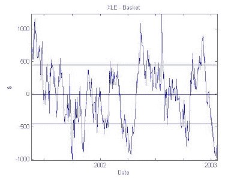
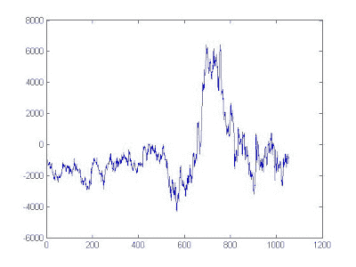
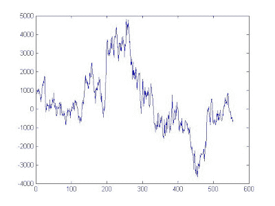

<!--yml
category: 未分类
date: 2024-05-12 19:24:12
-->

# Quantitative Trading: Out-of-sample test on cointegrating basket of stocks

> 来源：[http://epchan.blogspot.com/2007/04/anonymous-reader-l-posted-some.html#0001-01-01](http://epchan.blogspot.com/2007/04/anonymous-reader-l-posted-some.html#0001-01-01)

An anonymous reader "L" posted some thoughtful objections to the way I constructed the

[basket of stocks that is supposed to cointegrate with XLE](http://epchan.blogspot.com/2007/02/in-looking-for-pairs-of-financial.html "basket of stocks that is supposed to cointegrate with XLE")

. His main objection is that even though my basket shows cointegration with XLE in-sample, this is likely to fail out-of-sample. Actually, I agree with him that the strong statistical relationship discovered in-sample is most likely going to be weakened out-of-sample, most often because the nature of the component stocks is always changing, due to various corporate events (management change, restructuring, change of strategic direction, etc.). However, from a practical trading point of view, I believe that the relationship should not be weakened to the point that the trading signals become spurious, at least over a time-scale of a trade which is several months to half-a-year at most.

To demonstrate this, let's break up the dataset over 2 periods: 20010522 - 20030123 and 20030124 - 20070403\. In the first in-sample period (with 1,000 data points), we pick our 10 stocks to form the basket, and in the second out-of-sample period we see how well it cointegrates with XLE, and we observe how the spread behaves. I found that in the first period, the t-statistic for cointegration is -3.61934140, indicating the basket cointegrates with over 95% probability. No surprise here. Here is a plot of the spread in this period:

Now, let's find out what happens in the out-of-sample period. Here the t-statistic is just -2.72, whereas the critical value for cointegration at 90% probability is -3.03\. So indeed the basket fails to cointegrate at the 90% confidence level. Does that mean our trades will therefore be losing out-of-sample? Not necessarily. Take a look at the behavior of the spread out-of-sample:

Even though it is not nicely symmetric around zero as in the in-sample period, the spread is still clearly bounded around zero. If the basket completely falls out of cointegration with XLE, it will show a random drift

away

from zero as time goes on.

To show that this is not just good luck based on our specific in-sample period, let's try a longer in-sample period of 1500 days (shorter in-sample period won't work, because we need a minimum of 1,000 data points here to construct a good reliable basket.) Here the cointegration t-statistic is a bit worse, at -2.62\. If we look at the spread:

Once again, we see that the spread is bounded, not wandering off to infinity. So in conclusion, I maintain that my method of constructing the basket is good for practical trading, though not necessarily guaranteeing as high a statistical confidence level as might be indicated in the in-sample period.