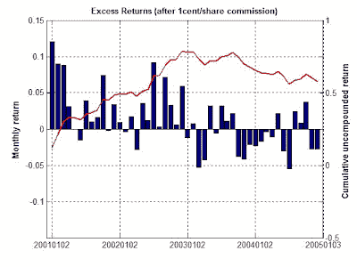
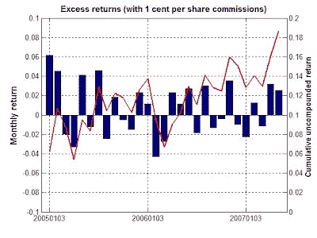

<!--yml
category: 未分类
date: 2024-05-12 19:23:22
-->

# Quantitative Trading: Pair trading stocks and the life-cycle of strategies

> 来源：[http://epchan.blogspot.com/2007/06/pair-trading-stocks-and-life-cycle-of.html#0001-01-01](http://epchan.blogspot.com/2007/06/pair-trading-stocks-and-life-cycle-of.html#0001-01-01)

I have discussed in various articles trading the spreads between pairs of

[ETF](http://epchan.blogspot.com/2006/11/gold-vs-gold-miners-another-arbitrage.html)

’s, or between

[a basket of stocks](http://epchan.blogspot.com/2007/02/in-looking-for-pairs-of-financial.html)

against an ETF using cointegration technique. There is, however, a glaring omission, as I haven’t yet mentioned the classic statistical arbitrage strategy: pair-trading stocks.

There are pros and cons on applying cointegration to pair-trading stocks. On the pro side: because of the large number of stocks, we can enjoy a highly diversified portfolio that improves the validity of our results. Even if a number of spreads fail to cointegrate going forward, we can count on a larger number of spreads that still do. (For e.g. my [USO-XLE](http://epchan.blogspot.com/2006/11/update-on-energy-stocks-vs-futures.html) spread fell apart, while [GLD-GDX](http://epchan.blogspot.com/2006/11/reader-suggested-possible-trading.html) spread is still tightly cointegrated.) There are 2 main cons: 1) stocks are subject to various specific risks which may render our purely statistical model useless, especially in M&A situations. Therefore it is customary to remove such stocks from our portfolio when they are involved in special situations – however, by the time the news is public we may have incurred substantial loss already; also 2) because of the technique’s long history, it became known to many hedge funds and indeed students of finance, and therefore pair trading stocks has not been very profitable, especially in the period 2003-2005\. Here I plotted the excess returns of the strategy as applied to US bank stocks from 20010102-20041231\. (Excess returns means credit interest on margin balance is not included.)

Interestingly, when a strategy becomes too popular and less profitable, many traders start to abandon it, or at least reduce their trading capital invested in the strategy. After a while, its popularity decreases, and the profitability recovers! This life-cycle of strategies reveals itself as mean-reversion of strategies, on top of mean-reversion of stock prices. In our case, this strategy recovery starts in 2005, and is still in full-force. Here I plotted the excess returns of the strategy as applied to US bank stocks from 20050103 to 20070531:

The average annual excess return in 2005-now is about 7.7% (on one-side of capital), and the Sharpe ratio is 0.8\. Since I have applied the technique on only one industry group, diversification is limited and therefore the Sharpe ratio is low. For the interested readers, they can attempt to apply this technique to more industry groups and perhaps generate a higher Sharpe ratio. Even with just one industry group, this trading strategy may be a good complement to a portfolio heavy on trend-following strategies and therefore require a reversal model to smooth out the returns.

I have started a model portfolio in my [subscription](http://epchan.com/subscriptions.html) area to demonstrate this strategy which will be updated daily around 3pm ET. Other details of the strategy will be detailed in an accompanying article there as well.