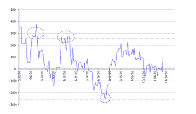

<!--yml
category: 未分类
date: 2024-05-12 19:27:08
-->

# Quantitative Trading: Reader suggested a possible trading strategy with the GLD - GDX spread

> 来源：[http://epchan.blogspot.com/2006/11/reader-suggested-possible-trading.html#0001-01-01](http://epchan.blogspot.com/2006/11/reader-suggested-possible-trading.html#0001-01-01)

Steve Hansen of Raymond James Ltd. in Vancouver, B.C.

[suggested](https://beta.blogger.com/comment.g?blogID=35364652&postID=2755485307492755002)

to me that a good trading signal for the GLD - GDX spread is when it exceeds 2 standard deviations from its mean. He observed that these are roughly at +/- $250 based on my

[definition](http://epchan.blogspot.com/2006/11/gold-vs-gold-miners-another-arbitrage.html)

of the spread, and that there were 3 such (immensely profitable) signals since the inception of GDX. Here is Mr. Hansen's plot:

This certainly looks like a fairly safe strategy. Of course, if one desires more frequent signals, one can always enter into smaller positions at smaller spread values.

By the way, just when we were celebrating the reversion of the GLD - GDX spread this morning, the

[QM - XLE](http://epchan.blogspot.com/2006/11/update-on-energy-stocks-vs-futures.html)

spread plunged to another multi-year low. With crude oil prices down about 30% from its all-time-high, XLE, the energy stocks ETF, is still within 5% of its all-time high. Does this make any sense? We shall see after this quarter's earnings from the oil companies are announced ...