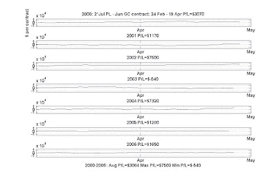

<!--yml
category: 未分类
date: 2024-05-12 19:24:01
-->

# Quantitative Trading: Recap: Platinum-gold spread trade

> 来源：[http://epchan.blogspot.com/2007/04/recap-platinum-gold-spread-trade.html#0001-01-01](http://epchan.blogspot.com/2007/04/recap-platinum-gold-spread-trade.html#0001-01-01)

The platinum-gold spread trade that I

[discussed](http://epchan.blogspot.com/2007/02/platinum-gold-spread-revisited.html)

is once again profitable this year. If a trader entered the positions near the close on February 26 and exited the positions near the close on April 19, the profit would have been about $6,610 this time. However, I did made a calculation mistake when I plotted the historical profit graphs before. So here it is again:

The maximum draw-down experienced in the last 7 years is -$4,860\. The average profit is $3,064, the maximum profit is $7,320 and the maxmium loss is -$540.

