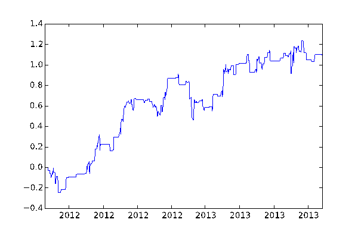
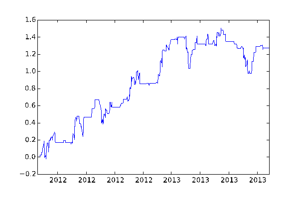
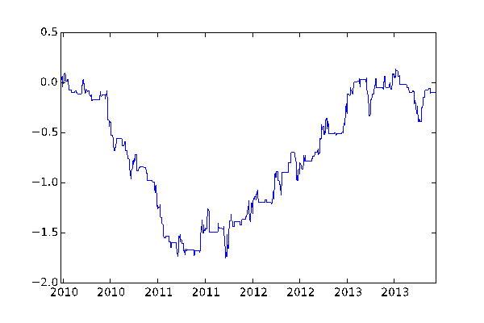

<!--yml
category: 未分类
date: 2024-05-12 18:57:14
-->

# Quantitative Trading: Trading with Estimize and I/B/E/S earnings estimates data

> 来源：[http://epchan.blogspot.com/2015/01/trading-with-estimize-and-ibes-earnings.html#0001-01-01](http://epchan.blogspot.com/2015/01/trading-with-estimize-and-ibes-earnings.html#0001-01-01)

*By Yang Gao*[Estimize](http://www.estimize.com/)

is an online-community utilizing 'wisdom of crowds' to offer intelligence about market. It contains a wide range of crowd-sourced estimates from over 4,500 buy-side, sell-side and individual analysts.

[Studies](http://www.estimize.com/api)

(from Deustche Bank and Rice University among others) show estimates from Estimize are more accurate than estimates from traditional sell-side analysts.

The first strategy we tested is a

[mean reversion strategy](http://www.deltixlab.com/research)

developed by the quantitative research team from Deltix using Estimize’s data. This strategy is based on the idea that post-earning-announcement prices typically revert from the short-term trend driven by the more recent Estimize estimates just before the announcement. We backtested this strategy with S&P100 over the period between 2012/01/01 and 2013/12/31\. (Even though Estimize has 2014 data, we do not have the corresponding survivorship-bias-free price data from the Center for Research in Securities Prices that includes the closing bid and ask prices.) With 5bp one-way transaction cost, we found that the backtest shows a Sharpe ratio of 0.8 and an average annual return of 6%.  The following figure is the cumulative P&L of the strategy based on $1 per stock position.

|  |
| Cumulative P&L of Deltix Mean Reversion Strategy with Estimize  |

It surprised us that a mean-reverting instead of a momentum strategy was used in conjunction with Estimize data, since earnings estimates and announcements typically generate price momentum. In order to show that this return is really driven by the information in Estimize and not simply due to price reversal, we provide a benchmark mean-reverting strategy that uses prices alone to generate signal:

1\. Find long period T and short period T_s, where T is average period of the reporting of all the quarterly estimates and T_s is average period of the reporting of the latest 20% of all estimates.

2\. Calculate stock return R over T and Rs over T_s, and let delta = R - Rs

3\. Buy stocks with delta > 0 at close before an earnings announcement and exit the positions next morning at the open after the announcement.

4\. Sell stocks with delta < 0 at close before an earnings announcement and exit the positions next morning at the open after the announcement.

5\. Hedge net exposure with SPY during the entire holding period.

This benchmark shows no significant positive return and so it does seem that there is useful information in the Estimize data captured by Deltix’s mean-reversion strategy.

Next, we compare the traditional earnings estimates from I/B/E/S gathered from sell-side Wall Street analysts to the crowd-sourced Estimize estimates. Backtest showed the same Deltix mean reversion strategy described above but using I/B/E/S estimates gave negative return over the same S&P100 universe and over the same 2012-2013 period, again supporting the thesis that Estimize estimates may be superior.

Since Deltix's mean reversion strategy gives negative returns on I/B/E/S data, it is natural to see if a momentum strategy would work instead: if the short-term average estimate is higher than the long-term average estimate (i.e. analogous to delta < 0 above), we expect the price to move up and vice verse.

The backtest result of this momentum strategy over the same universe and time period is quite promising: with 5bp transaction cost, the Sharpe ratio = 1.5 and average annual return = 11%. The following figure is the daily P&L of the strategy based on $1 per stock position

|  |
|  Cumulative P&L of momentum Strategy with I/B/E/S |

We tried the same momentum strategy using Estimize data over 2012-2013, and it generated negative returns this time. This is not surprising since we found earlier that the mean reversion strategy using Estimize data generated positive returns.

We proceeded to backtest this momentum strategy over the S&P100 using out-of-sample I/B/E/S data between 2010 and 2012, and unfortunately the strategy failed there too. The following figure is the daily P&L of the strategy from 2010-2014.

|  |
| Cumulative P&L of momentum Strategy with I/B/E/S  |

So how would Deltix’s mean-reversion strategy with Estimize data work over this out-of-sample period? Unfortunately, we won’t know because Estimize didn't start collecting data until the end of 2011\. The following table is a summary on the annual returns comparing different strategies using different data sets and periods.

As a result, we cannot conclude that Estimize data is consistently better than I/B/E/S data in terms of generating alpha: it depends on the strategy deployed. We also cannot decide which strategy – mean-reversion or momentum – is consistently better: it depends on the time period and the data used. The only conclusion we can reach is that the short duration of the Estimize data coupled with our lack of proper price data in 2014 means that we cannot have a statistically significant backtest. This state of inconclusiveness will of course be cured in time.

_________

===

**Industry Update**

(No endorsement of companies or products is implied by our mention.)

*   There is a good discussion comparing [Quantconnect](http://quantconnect.com/) to Quantopian [here](http://www.quora.com/Quantitative-Finance/What-are-the-advantages-and-disadvantages-of-Quantopian-v-Quantconnect).
*   For FX traders, [Rizm](http://rizm.io/) offers a comparable service as Quantconnect and Quantopian as it is directly connected to FXCM.
*   Quantopian now offers free fundamental data from MorningStar. Also, check out their [Quantopian Managers Program](https://www.quantopian.com/posts/announcing-the-quantopian-managers-program) where you can compete to manage real money.

===

**Workshop Update**

Our next online workshop will be 

[Millisecond Frequency Trading](http://www.epchan.com/workshops/)

 on March 25-26\. It is for traders who are interested in intraday trading (even if not at millisecond frequency) and who want to defend

*against*

certain HFT tactics.

===

**Managed Account Program Update**

===

Follow me on Twitter: @chanep