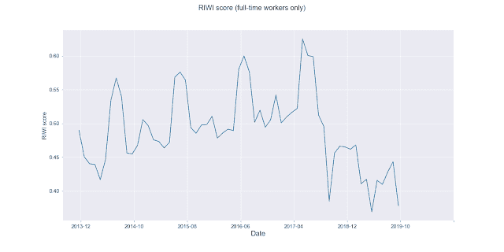

<!--yml
category: 未分类
date: 2024-05-12 18:54:46
-->

# Quantitative Trading: US nonfarm employment prediction using RIWI Corp. alternative data

> 来源：[http://epchan.blogspot.com/2019/12/us-nonfarm-employment-prediction-using.html#0001-01-01](http://epchan.blogspot.com/2019/12/us-nonfarm-employment-prediction-using.html#0001-01-01)

The monthly US nonfarm payroll (NFP) announcement by the United States Bureau of Labor Statistics (BLS) is one of the most closely watched economic indicators, for economists and investors alike. (When I was teaching a class at a well-known proprietary trading firm, the traders suddenly ran out of the classroom to their desks on a Friday morning just before 8:30am EST.) Naturally, there were many efforts in the past trying to predict this number, ranging from using other

[macroeconomic indicators](https://www.cmegroup.com/education/featured-reports/our-model-forecasts-may-non-farm-payroll-and-junes-too.html)

such as credit spreads to using

[Twitter sentiment](https://papers.ssrn.com/sol3/papers.cfm?abstract_id=2783520)

as predictive features. In this article, I will report on research conducted by Radu Ciobanu and I using the unique and proprietary continuous survey data provided by

[RIWI Corp.](file:///C:/QTS%20Capital%20Dropbox/Backtests/RIWI/riwi.com)

to predict this important number.

RIWI is an alternative data provider that conducts online surveys and risk measurement monitoring in all countries of the world anonymously, without collecting any personally identifiable information or providing incentives to respondents. RIWI’s technology has collected and analyzed more than 1.5 billion responses globally. Critically, in their surveys, they can reach a segment of the population that is usually hidden: three quarters of their respondents across the world have not answered a survey of any kind in the preceding month. Their surveys strive to be as representative of the general online population as possible, without the usual bias towards the loud social media voices. This is important in predictive data for financial markets, where it is vital to separate noise from signal.

The financial market reacts mainly to

*surprise*

, i.e. the difference between the actual announced NFP number and the Wall Street consensus. This surprise can move not only the US financial markets, but international markets as well. Case in point: I watched the German DAX index moved sharply higher last week (December 6, 2019 ) due to the huge positive surprise (adding 266K jobs instead of the Wall Street consensus of 183K).

Therefore the surprise is what we want to predict. We compared predicting the sign of this surprise using machine learning with the RIWI score as the only feature vs. a number of other benchmarks that do not include the RIWI score, and found that the RIWI score generates higher predictive accuracy than all other benchmarks during cross validation test. We also predicted both the magnitude and sign of the NFP surprise. Including the RIWI score as one of the features achieved the smallest averaged cross-validated mean squared error (MSE) than otherwise. Limited out-of-sample results indicate the RIWI score continues to have significant power for both sign and magnitude predictions.

The historical NFP monthly numbers were seasonally adjusted by the BLS. These numbers were released on the first Friday of every month, at 8:30 am ET (except on certain national holidays when they are released one day before or delayed by one week.) To compute the surprise, we subtract the Wall Street consensus on the day before the announcement from the actual NFP number.

The RIWI data were based on their online surveys of US consumers, and consist of two datasets. The first one is dated December 2013 - October 2017 and the second one is dated Sep 2018 - Sep 2019\. The former dataset is based on the yes/no answer to the following survey question:

*‘Are you working for more than 35 hours per week?’*

. The latter dataset is based on several survey questions related to opinions regarding US companies or products, along with respondents’ personal background, such as their employment status (full-time/part-time/student/retired), marital status, etc. In order to merge the two datasets, we regard respondents who said they worked “full-time” or “part-time” as equivalent to “working more than 35 hours per week”. If we were to count only the “full-time” respondents, a significant structural break in the time series would be observed between the two time periods, as seen in Figure 1 below.

**Figure 1**

: Weighted monthly RIWI score, without seasonal adjustments, including only “Full-Time” respondents

, for Dec 2013-Oct 2017 and Sep 2018-Sep 2019

.

If we include both “Full-time” and “Part-Time” respondents, we obtain Figure 2 below, which clearly doesn’t have that structural break.

**Figure 2:** Weighted monthly RIWI score,

without seasonal adjustments,

 including “Full-time + part-time” respondents, for Dec 2013-Oct 2017 and Sep 2018-Sep 2019.

RIWI provides a weight for each respondent in order to transform the data so that it can reflect the demographics of the general US population, hence the adjective “Weighted” in the figure captions. Note that the survey is conducted such that each respondent can go back and change their answers but they will not show up as more than one sample in the data set. In order to extract a summary score in advance of each month’s NFP announcement, we compute a monthly average of the product of the respondents’ weights and the indicator (0 or 1) of whether the individual respondent is working full or part-time. The monthly average is computed over the same month that the NFP number measures. We call this the “RIWI score”. As the NFP data were seasonally adjusted, we need to do the same to the monthly differences of the RIWI score. We employ the same adjustment that the BLS uses:

[X12-ARIMA](https://www.bls.gov/ces/)

. But for comparison purposes, we did not apply seasonal adjustment to Figures 1 and 2.

Our classification models were used to predict whether the sign of the NFP surprisewas positive or negative (there were no zero surprises in the data.) The models were trained on the data on

Dec 2013 – Oct 2017 (“train set”), where cross validation testing also took place. Out-of-sample testing was done on the data Sep 2018-Oct 2019 (“test set”). As mentioned above, the test set’s RIWI survey questions were somewhat different from the train set questions. So test set result is a joint test of whether the classification model works out-of-sample and whether the slight difference in the RIWI data degrades predictive accuracy significantly.To provide benchmark comparisons against RIWI score, we also studied several other standard features, some of which were found useful for NFP predictions:· Previous 1-month NFP surprise· Previous 12-month NFP surprise· Bloomberg Barclays US Corporate High Yield Average Option Adjusted Spread Index (a.k.a. credit spreads)· Index of Consumer Sentiment (University of Michigan)The Bloomberg Barclays US Corporate High Yield Average Option Adjusted Spread Index denotes the difference (spread) between a computed Option Adjusted Spread index of all high yield corporate bonds and a spot US Treasury curve. An Option Adjusted Spread index is computed using constituent bonds’ option adjusted spreads, weighted by market capitalization. In what follows, we will refer to the Bloomberg Barclays US Corporate High Yield Average Option Adjusted Spread Index as the “credit spreads” feature.Since machine learning can only be performed on stationary features, we will use the monthly differences in the RIWI score and other features.The benchmarks models we tested are:

1.  Logistic regression* on Previous surprise.
2.  Trend-following model predicts next sign(surprise)=sign(previous surprise).
3.  Contrarian model predicts next sign(surprise)=-sign(previous surprise).
4.  Logistic regression on credit spreads.
5.  Logistic regression on Index of Consumer Sentiment.

*All logistic regressions were L2-regularized.

Here are the results, compared to applying Random Forest to the RIWI score alone:

|  |  |  |  |
|  |  |  |  |
|  |  |  |  |
|  |  |  |  |
|  |  |  |  |
|  |  |  |  |
|  |  |  |  |
|  |  |  |  |

**Table 1**: Classification benchmarks and other features

Based on the predictive accuracy on the cross validation data, the best machine learning model is one that uses the RIWI score as the

*only*

feature. This model applied the random forest classifier to the RIWI score to predict sign(NFP surprise). It obtained an average cross-validated (CV) accuracy of 63%

+/- 0.03

(using 10-fold cross-validation on Dec 2013 – Oct 2017 data) and a 58.3% +/- 0.04 out-of-sample accuracy. As the out-of-sample data consists only of 12 data points, we view that as a test of whether the random forest classifier overfitted on training data, and whether the slightly different RIWI data affected predictions, but not as a fair comparison of the various models. Since the predictive accuracy did not deteriorate significantly on the out-of-sample data, we conclude that no overfitting was likely, and the new RIWI data did not differ significantly from that which we trained on. We have also applied random forest to all the features including the RIWI score, and found lower CV (53%) and out-of-sample (58%)

accuracies than using the RIWI score alone.

Our regression models were used to predict the actual NFP surprise (sign + magnitude). The train vs. test data were the same as for the classification models, and features set were also the same.

To provide benchmark comparisons against the RIWI score, we studied the following models:

1.  ARMA (2,1) model* that uses past NFP surprises.
2.  Trend-following model predicts next surprise=(previous surprise).
3.  Contrarian model predicts next surprise=-(previous surprise).

*The lags and coefficients were optimized based on AIC minimization on the train set.

Here are the results, compared to applying Random Forest to the RIWI score alone:

|  |  |  |  |
|  |  |  |  |
|  |  |  |  |
|  |  |  |  |
| Linear regression (Ridge) | Prev 1mth surprise +prev 12mth surprise |  |  |
|  |  |  |  |
|  |  |  |  |
|  |  |  |  |
|  |  |  |  |
|  | **RIWI score + prev 1mth surprise + prev 12mth surprise** |  |  |

**Table 2**: Regression benchmarks

Based on the mean squared error (MSE) of predicted surprises on the cross validation data, the best machine learning model is one that

*includes*

the RIWI score as a feature. It applied the random forest classifier to the RIWI score

, previous 1-month and 12-month surprises in order to predict actual NFP surprise

. It obtained an average cross-validated MSE of

3249.35 +/- 70

and a

7269.2+/- 134

out-of-sample accuracy. It marginally outperformed all benchmarks in cross-validation. As with all other benchmarks, including the Contrarian model which requires no training, out-of-sample MSE increased significantly over the CV MSE. But again, as the out-of-sample data consists only of 12 data points, we don’t view it as a fair comparison of the various models.

We also applied random forest to all the features including the RIWI score, and found somewhat higher CV MSE (and hence a worse model) than using the RIWI score alone, but the difference is within error bounds.**Conclusion and Future Work**

Using the technique of cross validation on RIWI data from

December 2013 - October 2017, we found that the RIWI score (after weighting, seasonal adjustment, and differentiation), has outperformed all other benchmarks in predictive accuracy for the sign of the NFP surprises. We also found that the similarly transformed RIWI score, if supplemented with other indicators, has performed as well or better than all other benchmarks. While such absolute dominance needs to be confirmed in an extended out-of-sample test, we believe there is great potential for using the RIWI score for predicting the all-important Nonfarm Payroll number.But beyond predicting NFP surprises, RIWI’s data have the potential to be a more accurate gauge of the actual U.S. employment situation, and therefore economic growth, than the NFP number. T

he “gig economy” is employing more workers whose data do not easily find their way into the official BLS count. (Here is an

[article](https://www.aspeninstitute.org/blog-posts/bls-data-on-platform-work-reflects-challenges-of-measurement/)

on why BLS’ effort to count these workers has been a failure. This Bank of Canada

[report](http://conference.iza.org/conference_files/Statistic_2019/kostyshyna_o28235.pdf)

also concluded that official numbers were undercounting gig workers.) Undocumented workers are not counted in the NFP but they do contribute to the economy. Even illegal activities could have contributed more than 1% to the U.S. GDP, according to this

[Wall Street Journal report](https://www.wsj.com/articles/gdp-doesnt-include-proceeds-of-crime-should-it-11575628201)

. In contrast, RIWI’s survey methodology was cited in this

[paper](https://journals.plos.org/plosmedicine/article?id=10.1371/journal.pmed.1002879)

by Harvard researchers among others as the

*preferred*

method of collecting data on hard-to-reach populations. One can imagine an ambitious researcher using RIWI data to directly predict GDP growth and achieving better results than using the traditional economic indicators such as NFP.

We thank Jason Cho, Head of Data Operations at

[RIWI](http://www.riwi.com/)

, for providing us the Company’s proprietary data for our evaluation purposes.

*Note a PDF version of this article can be downloaded from

[www.epchan.com](http://www.epchan.com/)

.