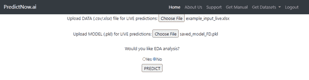
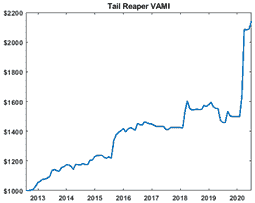

<!--yml
category: 未分类
date: 2024-05-12 18:54:31
-->

# Quantitative Trading: What is the probability of profit of your next trade? (Introducing PredictNow.Ai)

> 来源：[http://epchan.blogspot.com/2020/07/what-is-probability-of-profit-of-your.html#0001-01-01](http://epchan.blogspot.com/2020/07/what-is-probability-of-profit-of-your.html#0001-01-01)

What is the probability of profit of your next trade? You would think every trader can answer this simple question. Say you look at your historical trades (live or backtest) and count the winners and losers, and come up with a percentage of winning trades, say 60%. Is the probability of profit of your next trade 0.6? This might be a good initial estimate, but it is also a completely useless number. Let me explain.

This 0.6 is what may be called an *unconditional probability *of profit. It is the same for every trade that you will ever make (unless your winning ratio changes significantly in the future), so it is useless as a guide to whether you should take the next specific trade or not. It can of course tell you whether you should trade this strategy in general (e.g. you may not want to trade a strategy with an unconditional probability of profit, a.k.a. winning ratio, less than 0.51). But it can’t do so on a trade-by-trade basis. The latter is the *conditional probability* of profit. As the adjective suggests, this probability is conditioned on the specific market environment at the time when you expect to trade.

Let's say you are trading a short volatility strategy. It can be an algorithmic, or even discretionary, strategy. If you are trading it during a very calm market, it is likely that your conditional probability of profit would be quite high. If you are trading during a financial crisis, it could be very low. The conditions that can determine the probability may even be quantifiable.  The level of VIX? The recent SPY returns? How about the interest rate change or [Nonfarm Payroll](https://epchan.blogspot.com/2019/12/us-nonfarm-employment-prediction-using.html) number just announced? Or even the % change in Covid-19 cases on the previous day? You may not have taken all these myriad numbers into account when you were building your simple trading strategy, or when you decide to make a discretionary trade, but you can't deny they may have an impact on the conditional probability of profit. So how are we to compute this probability?

*Spoiler alert*: computing this conditional probability helped us earned 64% YTD return as of June 2020\. You can find out how to do that with [predictnow.ai](https://predictnow.ai). But more on that later.

The only known way to compute this conditional probability is machine learning. Let's return to the example of your short volatility strategy above. Suppose you prepare a spreadsheet of the returns of the historical trades you have done, like this:

Figure 1: Spreadsheet with historical returns of short vol trades.

Again, these trades could be due to an algorithm, or it could be discretionary (perhaps based on some combination of fundamental analysis and intuition like what Warren Buffet does).

Now let's say we only care about whether they are profitable or not, so we ignore the magnitude of returns and label those trades that are profitable 1, otherwise 0\. (These are called "metalabels" by [Marcos Lopez de Prado](https://www.amazon.com/dp/1119482089/ref=as_sl_pc_tf_til?tag=quantitativet-20&linkCode=w00&linkId=d7381a1bc4fd7adf25c210b2967e15be&creativeASIN=1119482089), who pioneered this financial machine learning technique. They are “meta” because he assumed the original simple strategy is used to predict the ups and downs of the market itself – those are the base predictions, or labels. The metalabels are on whether those base predictions are correct or not.) The resulting spreadsheet looks like this. 

Figure 2: Spreadsheet with labels: are historical returns of short vol strategy profitable?

Simple, right? Now comes the hard part. Your intuition tells you that there are some variables that you didn't take into account in your original, simple, trading strategy. There are just too many of these variables, and you don't know how to incorporate them to improve your trading strategy. You don't even know if some of them are useless. But that's not a problem for machine learning. You can add as many variables, called features / predictors / independent variables, as you like, useful or not. The machine learning algorithm will get rid of the useless features via a process called [feature selection](https://arxiv.org/abs/2005.12483). But more on that later.

So let's say for every historical trade (represented by a row in the spreadsheet), you collect some features like VIX, 1-day SPY return, change in interest rate on the previous day, etc. We must, of course, ensure that these features' values were known prior to each trade's entry time, otherwise there will be look-ahead bias and you won't be able to use this system for live trading. So here is how your spreadsheet augmented with features may look: 

Figure 3: Spreadsheet with features augmented.

OK, now that you have prepared all these historical data, how do you build (or "train", in machine learning parlance) a predictive model based on that? You may not know it, but you have probably used the simplest kind of machine learning model already, maybe way back in a college statistics class. It is called linear regression, or its close sibling logistic regression for our binary (profit or not) classification problem. Those features that you created above are just the independent variables, often called X (a vector of many variables), and the labels are just the dependent variable often called Y (with values of 0 or 1). But applying linear or logistic regression on a large, disparate set of features to predict a label usually fails, because many relationships cannot be captured by a linear model. The nonlinear co-dependences between these predictors need to be discovered and utilized. For example, maybe when VIX <= 15, the 1-day SPY return isn't useful for predicting the probability of profit of your trade. But when VIX >= 15, 1-day SPY return is very useful. This type of relationship is best discovered using a "supervised" hierarchical learning algorithm called random forest, which is what we have implemented on [predictnow.ai](https://predictnow.ai/). 

A random forest algorithm may discover the hypothetical relationship between VIX, 1-day SPY return, …, and whether your short vol trade will be profitable as illustrated in this schematic diagram: 

Figure 4: Example classification tree generated by predictnow.ai internally.

To build this tree, and all its cousins that together form a "random forest", all you need to do is to upload your spreadsheet above to [predictnow.ai](https://predictnow.ai/), click a button, and it will probably be done in less than 15 minutes, often much sooner. (Certainly faster than a pizza delivery.)

Figure 5: Choosing training mode at predictnow.ai.

Figure 6: Uploading training data.

Figure 7: Choosing hyperparameters for building random forest.

Once this random forest is built (trained) with historical data, it is ready for your live trading. You can just plug in the latest values for VIX, 1-day SPY, and any other features into a new spreadsheet like this:

Figure 8: Live trading input.

Notice that the format of this spreadsheet is the same as the training data, except that there is no known Return of course - we are hoping to predict that! You can upload this to [predictnow.ai](https://predictnow.ai/) together with the model you just trained, press PREDICT, 

Figure 9: Live prediction.

and voila! You can now download the random forest's prediction of whether that trade will be profitable, and with what** conditional probability**.

Figure 10: Live prediction, with probability.

One of the output files (left in Figure 10) tells you the most likely outcome of your trade: profit or not. The other file (right one in Figure 10) tells you the probability of that outcome. **You can use that probability to size your trade.** For example, you may decide that if the probability of profit is higher than 0.6, you will buy $10K of TSLA. But if the probability is between 0.51 and 0.6, you will only buy $5K, while if the probability is lower than 0.51, you won’t buy at all.

Typically the live prediction will take 1 second or less, while the training (which may not need to be re-done more than once a quarter) typically won't take more than 15 minutes even for thousands of rows of historical data with 100 features. You can make live predictions as frequently as you like (*i.e.* as frequently as your input changes), but if you are a high frequency trader, you would want to use our API so that our predictions can be seamlessly integrated with your trading system.

But predicting the conditional probability of profit for your next trade is not all that we can do. We can also tell you what features are important in making that prediction. In fact, you may be more interested in that than a black-box prediction, because this list of important features, sorted in decreasing order of importance, may help you improve your underlying simple trading strategy. In other words, it can help improves your intuition about what works with your strategy, so you can change your trading rules.

Going back to our example, [predictnow.ai](https://predictnow.ai/) can generate such a graph for you: 

Figure 11: Features with decreasing importance

You can see that VIX was deemed the most important feature, followed by 1-day SPY return, the latest interest rate change, and so on. Our internal predictive algorithm will actually remove all features that are "below average" and retrain the model, but you may benefit from incorporating just VIX and 1-day SPY return in your simple strategy when it generates a trading signal. Remember, your simple strategy does not need to be an algorithmic strategy. It could be discretionary.

(For the machine learning mavens among you, we use SHAP for feature selection, as discussed in our [paper](https://arxiv.org/abs/2005.12483).)

You may wonder why our predictive service is restricted to only taking your strategy’s historical or live trades as input and predicting their probabilities of profit. Why can’t it be used directly to predict the market’s return? Of course it can: you only need to pretend that your strategy is buy-and-holding the market. It can even predict the magnitude, not just the sign, of the return. But as we all know, it is very hard to predict the market’s movement, because of low signal-to-noise ratio. Your own strategy, however, has presumably found a way to filter out those noise, and machine learning prediction is more likely to succeed in telling you what “regime” is favorable/unfavorable to your strategy, and with what probability. Another usage of our service is to use it to predict numbers that are not subject to arbitrage, things such as a company’s earning surprise, credit rating change, or the US nonfarm payroll surprise (as we have already [done](https://epchan.blogspot.com/2019/12/us-nonfarm-employment-prediction-using.html) successfully). In these usages, there are no adversaries (your fellow traders) that are trying their hardest to arbitrage away your trading alpha, so these predictions will be more likely to work far into the future. 

(For machine learning mavens, you may wonder why we have only implemented random forest learning algorithm. The beauty of random forest is that it is simple, but not too simple. Complicated deep learning algorithms such as LSTM can indeed take into account the time series dependence of the features and labels more readily, but they run serious risk of data snooping due to the large number of parameters to fit. GPT-3, the latest and hottest deep learning algorithm for natural language processing, for example, has more than 175 *billion* parameters to fit. Imagine fitting that to 1,000 historical trades!)

So does this stuff really work? We have implemented this machine learning system for our [Tail Reaper strategy](http://www.qtscm.com/accounts) in our fund around the August of 2019\. Yes, the 64% YTD return as of June 2020 (net of 25% incentive fee!) is nice, but what's more amazing is that the machine learning program told us to not enter any trade (due to the low conditional probability of profit) from Nov 2019 - Jan 2020\. In retrospect, that made sense because Tail Reaper is a crisis alpha, tail hedge strategy. There was no crisis, no tail movement, from which to reap profits in those calm months. But suddenly, starting on February 1, 2020, this machine learning program told us to expect a crisis. We thought the machine learning program was nuts - there were just a handful of Covid-19 cases in the US at that time! Nonetheless we followed its advice and restarted Tail Reaper. It went on to capture over 12% return later that month, and the rest is history. *(Past performance is not necessarily indicative of future results. For detailed disclosure of this strategy, please visit qtscm.com.)*

**

*Figure 12: Tail Reaper equity curve.*

**For readers interested in a free trial or to participate in a live webinar on how to use **[predictnow.ai](http://predictnow.ai)** to predict the conditional probability of profit of your trades, please sign up *[*here*](https://predictnow.ai/register)*.**