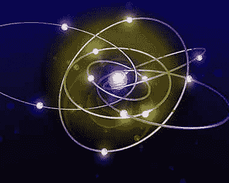

<!--yml
category: 未分类
date: 2024-05-12 17:57:36
-->

# Quantum RSO | CSSA

> 来源：[https://cssanalytics.wordpress.com/2013/10/08/quantum-rso/#0001-01-01](https://cssanalytics.wordpress.com/2013/10/08/quantum-rso/#0001-01-01)

In the last post on [Random Subspace Optimization (RSO)](https://cssanalytics.wordpress.com/2013/10/06/random-subspace-optimization-rso/ "Random Subspace Optimization (RSO)") I introduced a method to reduce dimensionality for optimization to improve the robustness of the results. One concept proposed in the previous article was to weight the different subspace portfolios in some manner rather than just equally weighting their resulting portfolio weights to find the final portfolio. Theoretically this should improve the resulting performance out of sample.

One logical idea is to compound the algorithm multiple times. This idea is driven from the notion that complex problems can be more accurately solved by breaking them down into smaller sub-problems. Quantum theory is the theoretical basis of modern physics that explains the nature and behavior of matter and energy on the atomic and subatomic level. Energy, radiation and matter can be quantized- or divided up into increasingly smaller units which helps to better explain their properties.

By continuing to synthesize and aggregate from smaller subsamples, it may be possible to do a better job at optimizing the universe of assets than optimizing globally only once with all assets present. There is no reason why RSO can’t borrow the same concept to optimally weight subspace portfolios. Imagine taking the subspace portfolios formed at the first level and then running the same optimization (with the same objective function) using the RSO on the subspace portfolios. The analogy would be: RSO(RSO) where the RSO portfolios become “assets” for a new RSO. This is like the concept of generations in genetic algorithms. In theory this could proceed multiple times- ie RSO(RSO(RSO)). Borrowing a concept from micro-GA, one could run a small number of samples and run multiple levels of RSO and then start the process over again instead of expending computational resources on one large sample.