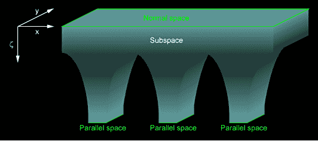

<!--yml
category: 未分类
date: 2024-05-12 17:57:52
-->

# Random Subspace Optimization (RSO) | CSSA

> 来源：[https://cssanalytics.wordpress.com/2013/10/06/random-subspace-optimization-rso/#0001-01-01](https://cssanalytics.wordpress.com/2013/10/06/random-subspace-optimization-rso/#0001-01-01)

In the last post, we discussed [mean-variance optimization and its relationship to statistical theory](https://cssanalytics.wordpress.com/2013/10/03/mean-variance-optimization-and-statistical-theory/ "Mean-Variance Optimization and Statistical Theory"). One of the challenges of optimization and creating trading models is trying to extract generalizable results when the search space is large. This is especially problematic when the quantity of data is small in relation to the number of features. This is known as the curse of dimensionality. A good slide (Gutierrez-Osuna, Intro to Pattern Recognition) depicts how adding features increases data sparsity in relation to sample size:

The curse of dimensionality implies that there is an optimal number of features that can be selected in relation to sample size to maximize classifier performance. The challenge of reducing dimensionality is therefore critical:

The same concepts apply to mean-variance or any other type of portfolio optimization method where there are a lot of inputs to estimate, a certain number of assets and also a calibration or lookback window to estimate the inputs. In a typical portfolio optimization with “K” assets and a lookback window of “N” dimensionality can be expressed  approximately as:

**D=K/N**

*note this excludes the number of different types of inputs required for the optimization (ie returns, covariance, variance)

A large K and a small N or any other combinations that produce a high ratio will reduce the likelihood that an optimization is meaningful.  If for example, I perform mean-variance optimization on 500 stocks in the S&P 500 with 20 days of data, the resulting portfolio weights should be unlikely to outperform a more naaive equal weight benchmark. Ideally K would be a fraction that is as small as possible, while preserving the latency of the data with shorter lookback windows. Methods such as re-sampling/bagging and shrinkage are not very effective at reducing the dimensionality of the problem. I would like to introduce a simple method to address this problem directly. Enter the [“random subspace method”](http://en.wikipedia.org/wiki/Random_subspace_method) (RSM) which was introduced to improve classification on highly dimensional problems such as gene expression. The basic idea is that RSM randomly selects a smaller number of features from a much larger feature set and calibrates classifiers on the lower dimensional “subspaces.” These classifiers and then aggregated in an ensemble where their forecasts are averaged to produce a final forecast or classification.  In RSO, this can be generalized as using a particular optimization method, and selecting “k” assets randomly from the original pool of “K” assets (where k<K) and performing the optimization on each subspace. These weights are then aggregated in some manner (either weighted or equally-weighted) to find the final portfolio weights. This should produce a final portfolio that is more robust in most cases than running optimization on all assets simultaneously. To extend the example to the S&P500, one might select 100 samples of 100 assets from the S&P500 and running optimization on each sample and then aggregate the weights to determine the final portfolio. Here is the pseudo-code:

1) Select a value for “k”, and a number of random subspaces “s”

2) Choose k assets randomly from K assets in the universe and perform optimization

3) Repeat this procedure “s” times

4) Average the weights across the subspaces using some heuristic- this is the final set of portfolio weights

There are a lot of logical extensions to this idea- including varying the number of input factors used in the optimization- for example, one could assume that either the returns, covariances or variances are all equivalent as a method of projecting subspaces. One could use both assets and input factors at the same time to project subspaces. Furthermore, RSO is completely compatible with re-sampling/bagging and shrinkage, and these can also be performed simultaneously in the same process. RSO can be employed with virtually any type of optimization procedure- with the caveat that it is a slower procedure and is less compatible with stochastic methods.