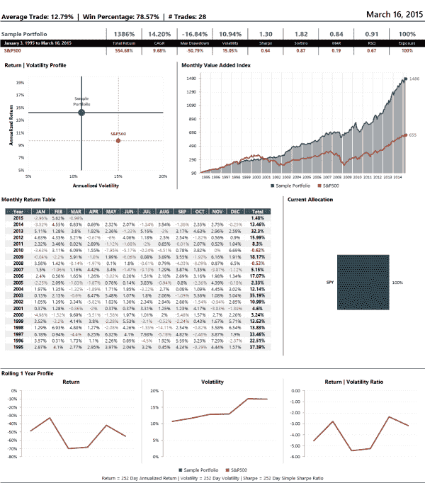
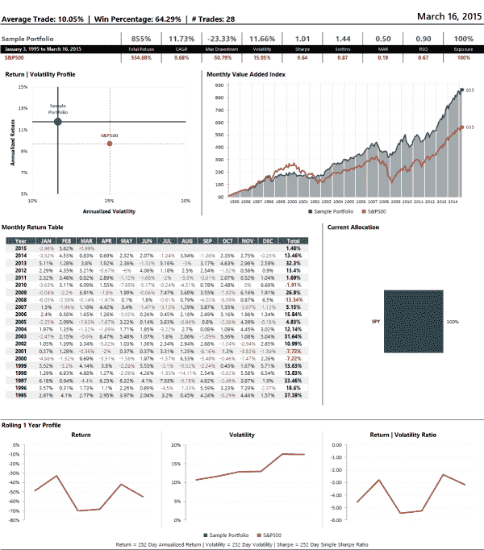

<!--yml
category: 未分类
date: 2024-05-12 17:46:32
-->

# Real Momentum: A Longer-Term Backtest | CSSA

> 来源：[https://cssanalytics.wordpress.com/2015/05/09/real-momentum-a-longer-term-backtest/#0001-01-01](https://cssanalytics.wordpress.com/2015/05/09/real-momentum-a-longer-term-backtest/#0001-01-01)

In the [last pos](https://cssanalytics.wordpress.com/2015/05/07/real-momentum-a-time-seriesabsolute-momentum-strategy-including-inflation-expectations/ "Real Momentum:  A Time-Series/Absolute Momentum Strategy Including Inflation Expectations")t I introduced the concept of “real momentum” which is a trend following signal based on real returns. In the post I used both expected inflation and risk-free returns to net out from the S&P500 to create a real excess return. This was done to make the hurdle for buy positions higher than the standard method. Several comments from readers indicated that this is”double-counting” and obviously from an economic standpoint this is true:  real returns should only subtract out the return of inflation (or expected inflation).  Theory would dictate taking this approach versus a real excess return. Since this is a simplification, that is desirable since it better avoids claims of “data-snooping.” Furthermore, since this was a preliminary study,  in the previous post I did a quick test using only 10 years of data with the ETFs available. Clearly this is not ideal for assessing whether the concept has merit or is robust. To obtain more data, I used mutual fund proxies for TIP and IEF I was able to extend results back to 1995 ( for TIP I used Loomis Sayles Inflation Protected Secutities Mutual Fund (LSGSX) and for IEF I used T Rowe Price US Treasury Intermediate Fund). Following the advice of readers I subtracted out the expected inflation rate only- which is the differential return between TIP and IEF (smoothed using an optional lookback- anywhere between 3-10 days yields similar results, I chose 5 for these tests)- from the daily returns of the S&P500 (SPY) and then take the average of those returns. If the return is positive then go long, if negative then go to cash. Without assuming a return on cash here are the results compared to a traditional absolute/time-series momentum strategy that uses a risk-free rate or proxy such as short-term treasurys (SHY). Note that rebalancing was done on a monthly basis.

The results seem to clearly favor Real Momentum- which is impressive considering we simplified the calculation and also extended the lookback for 10-years that are “out of sample.”  On average, the Real Momentum signal produces nearly a 1% advantage in CAGR annualized and a near 15% improvement in the sharpe ratio. It seems on the surface that real equity risk premiums may be more important to large investors that can move markets. But as my colleague Corey Rittenhouse points out, if you aren’t going to invest in something that has a negative real rate of return then you need to have an alternative.  I agree with this point, and one logical option is to hold TIP- or Inflation-Protected Treasurys when Real Momentum is negative.  Using a 120-day  Real Momentum with the strategy parameters above, a baseline strategy goes long SPY/S&P500 when Real Momentum is >0 and holds TIP when momentum is <0\. Here is what this looks like:

For comparison, here is absolute momentum using SPY and SHY with the same 120-day parameter:

As you can see the Real Momentum strategy outperforms the Absolute Momentum strategy, with higher accuracy on winning trades and higher gains per trade along with higher return and a higher sharpe ratio with a similar maximum drawdown. Some readers may point out that this comparison may not be fair because TIP returns more than SHY as the cash asset. As the first table shows, the timing signal itself is superior so that is unlikely to be the driving factor. But just to prove that, here is the Absolute Momentum strategy using SHY as the asset to trigger the signal but holding TIP as the cash asset:

This is substantially worse than the  Real Momentum strategy and worse than the Absolute Momentum strategy using SHY as the cash asset. While not shown, using TIP as the signal asset and the cash asset does the worst of all. So apparently there is something there with respect to looking at Real Momentum- or effectively the expected real return to the broad equity market/S&P500\. This is not the final word on the strategy, and it would be helpful to run an even longer-term test (one can never have too much data as they say….). But after looking at the performance on other risk assets using this signal, I can’t reject the hypothesis that there isn’t something there at first pass.  It is something that makes sense, and seems to be supported by data even after simplification and an out-of-sample test. It would be interesting to run a deeper analysis to see what is going on and whether this is merely a spurious result that is driven by some other factor.  A basic Real Momentum strategy that holds the S&P500 when expected real returns are positive and holds Treasury Inflation Protected Securities when they are negative earns very good returns and risk-adjusted returns and beats buy and hold over a 20-year period by nearly 5% annualized. The strategy also happens to be relatively tax-efficient compared to more complex strategies which is a bonus.