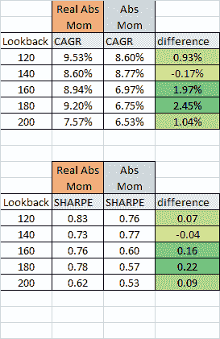

<!--yml
category: 未分类
date: 2024-05-12 17:46:49
-->

# Real Momentum: A Time-Series/Absolute Momentum Strategy Including Inflation Expectations | CSSA

> 来源：[https://cssanalytics.wordpress.com/2015/05/07/real-momentum-a-time-seriesabsolute-momentum-strategy-including-inflation-expectations/#0001-01-01](https://cssanalytics.wordpress.com/2015/05/07/real-momentum-a-time-seriesabsolute-momentum-strategy-including-inflation-expectations/#0001-01-01)

“[Time-Series Momentum](http://pages.stern.nyu.edu/~lpederse/papers/TimeSeriesMomentum.pdf)” was introduced by Moskowitz and Pedersen of AQR circa 2011 and was popularized by Antonacci in 2013 as “[Absolute Momentum](http://papers.ssrn.com/sol3/papers.cfm?abstract_id=2244633).” Both measure the return of an asset in excess of the risk-free rate over some lookback window in order to determine whether to hold a long position in a given asset or whether to hold cash or go short.  This method has been used by trend-followers for decades in some form or another. The academic research on the subject by Moskowitz and Pedersen served to demonstrate how robust this effect is across a wide variety of different markets. Antonacci demonstrated how this  method could be used within tactical strategies including asset classes, and subsequently how it could be combined with relative strength via “Dual Momentum.”

The concept has always been appealing to me, and it makes sense to use this method to reduce the downside risk of holding a chosen asset class. In thinking about this concept, I could see why excess returns- or the return minus the risk free rate- was theoretically appealing since this is the basis of modern financial economic theory. But I also realized that investors do not earn nominal returns- they earn real returns net of inflation. The cost of living goes up, and so nominal returns must keep pace with inflation in order to provide an investor with a real return on their investments. It is rational for an investor to avoid assets with negative excess returns.  If the excess return is negative net of inflation (or the real excess return is negative) then this should make an asset even less desirable for an investor.

The challenge is that inflation is somewhat elusive. Measures such as the CPI- Consumer Price Index- are released monthly with a lag, and are at best a vague measure of the change in the cost of goods for a typical consumer. Perhaps one of the best ways to get access to a real-time estimate of inflation is to look at yield curve of Treasury Inflation Protected Securities (TIPS) versus the comparable duration of a regular Treasury bond. The difference between these two represents expected inflation which is forward looking. Since there is often no matching bond duration for a TIP versus a traditional treasury, this real yield needs to be interpolated using a nonlinear estimation. A quick and convenient (albeit imperfect) way to capture this is to look at the difference in returns between the 7-10 year Treasury Bond (IEF) and  the Treasury Inflation Protected Bond (TIP) which are both ETFs that trade daily.  Both have an effective duration that is approximately 8 years, which makes them roughly equivalent. The daily difference in their total returns is essentially the change in expected inflation. Since this can be somewhat noisy, I chose to smooth this using a 10-day average. To proxy the risk-free rate, I use the short-term Treasury or (SHY). To calculate “Real Momentum”, I use an average of daily real excess returns. This is essentially the daily return of an asset minus the return of the risk-free rate (SHY) and the smoothed return of expected inflation (10-day sma of daily return difference between TIP and IEF).

**Real Momentum**= return of asset- risk free return- expected inflation

or the simple moving average of the:

Daily return of asset- Daily return of risk free proxy (SHY)- Daily return (smoothed) of expected inflation proxy (TIP-IEF smoothed)

For comparison with Absolute or conventional Time-Series Momentum it is important to use an average daily return proxy which is simply the average of the daily excess return of an asset minus the return of SHY.  Here are the results comparing Real Momentum with Absolute Momentum from 2005 (June) to Present using the S&P500 (SPY). Note that there is limited data for TIP, so this was approximately the earliest start date that could accomodate the different lookbacks.

Over this 10-year period, it appears that Real Momentum is superior to Absolute Momentum which matches what we might expect theoretically. On average, the difference appears to be marginally significant on visual inspection. But I am not yet convinced with these preliminary tests that the difference is real (no pun intented). Trend-following strategies require a lot of data to have statistical significance because they don’t trade very frequently.  A longer testing period would be preferable along with a test that incorporates the real yield instead of the TIP/IEF differential which is not a perfect basis for comparison (which is why smoothing is preferred to using the raw daily difference). Alternatively, one could use a proxy for TIP that goes back farther in time.  Since this testing is in the preliminary stage, I would caution that it is difficult to draw any firm conclusions just yet. But the concept of a real absolute returns is appealing, it is just trickier to quantify in light of the fact that inflation itself can be calculated so many different ways. Feel free to share your ideas/comments and suggestions on this interesting topic.