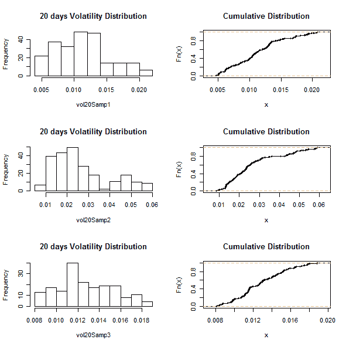
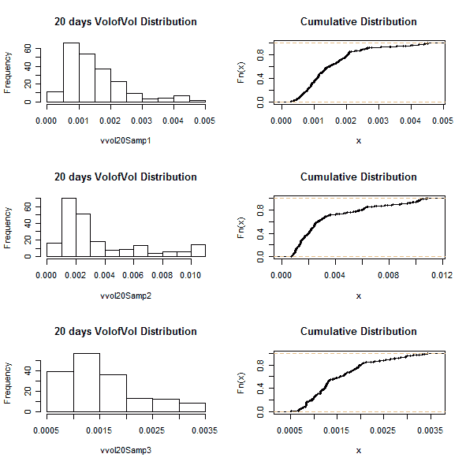

<!--yml
category: 未分类
date: 2024-05-18 14:04:21
-->

# Recent Volatility Distributions – Quantum Financier

> 来源：[https://quantumfinancier.wordpress.com/2010/08/16/recent-volatility-distributions/#0001-01-01](https://quantumfinancier.wordpress.com/2010/08/16/recent-volatility-distributions/#0001-01-01)

I was not happy with last post’s graph, it did not give a good perspective on the recent distribution of volatility. This quick post is to show the distribution of the last three years so it is easier to compare. Stay tuned this week for deeper analysis of volatility of volatility and applications to trading.

Volatility

Volatility of volatility

QF