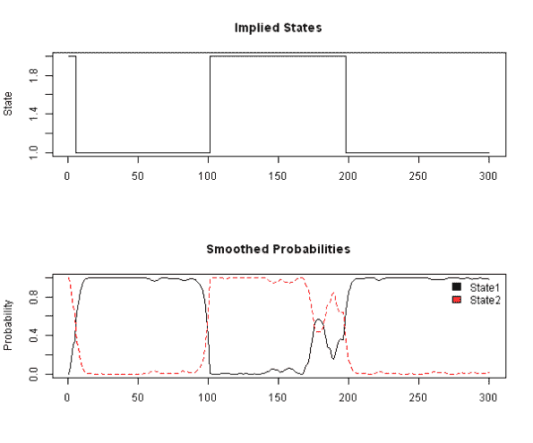
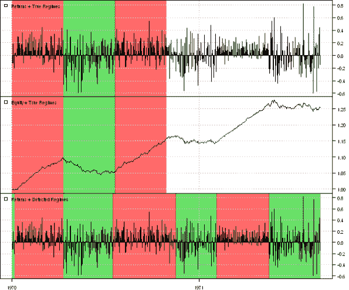

<!--yml
category: 未分类
date: 2024-05-18 14:36:16
-->

# Regime Detection | Systematic Investor

> 来源：[https://systematicinvestor.wordpress.com/2012/11/01/regime-detection/#0001-01-01](https://systematicinvestor.wordpress.com/2012/11/01/regime-detection/#0001-01-01)

Regime Detection comes handy when you are trying to decide which strategy to deploy. For example there are periods (regimes) when Trend Following strategies work better and there are periods when Mean Reversion strategies work better. Today I want to show you one way to detect market Regimes.

To detect market Regimes, I will fit a Hidden Markov Regime Switching Model on the set of simulated data (i.e. Bull / Bear market environments) I will use the excellent example from the [Markov Regime Switching Models in MATLAB](http://blogs.mathworks.com/pick/2011/02/25/markov-regime-switching-models-in-matlab/) post and adapt it to R.

The idea behind using the Regime Switching Models to identify market states is that market returns might have been drawn from 2 or more distinct distributions. As a base case, for example, we may suppose that market returns are samples from one normal distribution N(mu, sigma) i.e.

```

Returns = mu + e, e ~ N(0, sigma)

```

Next we may suppose that market returns are samples from two normal distributions (i.e. returns during Bull market may be ~ N(mu.Bull, sigma.Bull) and returns during Bear market may be N(mu.Bear , sigma.Bear) i.e.

```

Returns = mu + e, e ~ N(0, sigma) 
mu = mu.Bull for Bull regime and mu.Bear for Bear regime and
sigma= sigma.Bull for Bull regime and sigma.Bear for Bear regime

```

Fortunately we do not have to fit regimes by hand, there is the [RHmm package for Hidden Markov Models at CRAN](http://r-forge.r-project.org/projects/rhmm/) that uses the Baum-Welch algorithm to fit Hidden Markov Models.

Next, let follow the steps from the [Markov Regime Switching Models in MATLAB](http://blogs.mathworks.com/pick/2011/02/25/markov-regime-switching-models-in-matlab/) post.

```

###############################################################################
# Load Systematic Investor Toolbox (SIT)
# https://systematicinvestor.wordpress.com/systematic-investor-toolbox/
###############################################################################
setInternet2(TRUE)
con = gzcon(url('http://www.systematicportfolio.com/sit.gz', 'rb'))
    source(con)
close(con)

	#*****************************************************************
	# Generate data as in the post
	#****************************************************************** 
	bull1 = rnorm( 100, 0.10, 0.15 )
	bear  = rnorm( 100, -0.01, 0.20 )
	bull2 = rnorm( 100, 0.10, 0.15 )
	true.states = c(rep(1,100),rep(2,100),rep(1,100))
	returns = c( bull1, bear,  bull2 )

	# find regimes
	load.packages('RHmm')

	y=returns
	ResFit = HMMFit(y, nStates=2)
	VitPath = viterbi(ResFit, y)

	#Forward-backward procedure, compute probabilities
	fb = forwardBackward(ResFit, y)

	# Plot probabilities and implied states
	layout(1:2)
	plot(VitPath$states, type='s', main='Implied States', xlab='', ylab='State')

	matplot(fb$Gamma, type='l', main='Smoothed Probabilities', ylab='Probability')
		legend(x='topright', c('State1','State2'),  fill=1:2, bty='n')

```

[](https://systematicinvestor.wordpress.com/wp-content/uploads/2012/10/plot1-small4.png)

The first chart shows states (1/2) determined by the model. The second chart shows the probability of being in each state.

Next, let’s generate some additional data and see if the model is able to identify the regimes

```

	#*****************************************************************
	# Add some data and see if the model is able to identify the regimes
	#****************************************************************** 
	bear2  = rnorm( 100, -0.01, 0.20 )
	bull3 = rnorm( 100, 0.10, 0.10 )
	bear3  = rnorm( 100, -0.01, 0.25 )
	y = c( bull1, bear,  bull2, bear2, bull3, bear3 )
	VitPath = viterbi(ResFit, y)$states

	#*****************************************************************
	# Plot regimes
	#****************************************************************** 
	load.packages('quantmod')
	data = xts(y, as.Date(1:len(y)))

	layout(1:3)
		plota.control$col.x.highlight = col.add.alpha(true.states+1, 150)
	plota(data, type='h', plotX=F, x.highlight=T)
		plota.legend('Returns + True Regimes')
	plota(cumprod(1+data/100), type='l', plotX=F, x.highlight=T)
		plota.legend('Equity + True Regimes')

		plota.control$col.x.highlight = col.add.alpha(VitPath+1, 150)
	plota(data, type='h', x.highlight=T)
		plota.legend('Returns + Detected Regimes')				

```

[](https://systematicinvestor.wordpress.com/wp-content/uploads/2012/10/plot2-small4.png)

The first 300 observations were used to calibrate this model, the next 300 observations were used to see how the model can describe the new infromation. This model does relatively well in our toy example.

To view the complete source code for this example, please have a look at the [bt.regime.detection.test() function in bt.test.r at github](https://github.com/systematicinvestor/SIT/blob/master/R/bt.test.r).