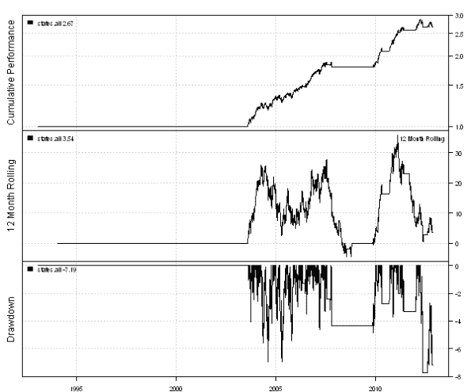
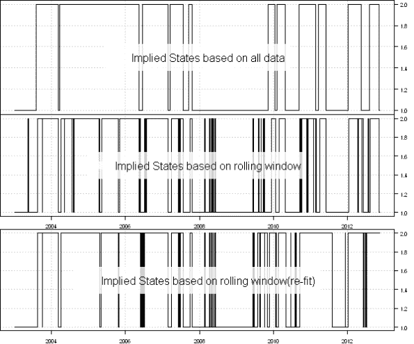
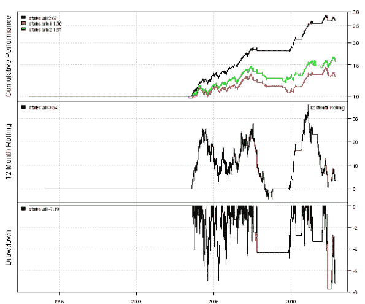

<!--yml
category: 未分类
date: 2024-05-18 14:35:56
-->

# Regime Detection Pitfalls | Systematic Investor

> 来源：[https://systematicinvestor.wordpress.com/2012/11/15/regime-detection-pitfalls/#0001-01-01](https://systematicinvestor.wordpress.com/2012/11/15/regime-detection-pitfalls/#0001-01-01)

Today, I want to address some questions that I was getting regarding the [Regime Detection](https://systematicinvestor.wordpress.com/2012/11/01/regime-detection/) post. In the [Regime Detection](https://systematicinvestor.wordpress.com/2012/11/01/regime-detection/) post I showed an example based on the simulated data, and some of you tried to apply this example to actual stocks.

There is one big problem that you have to be aware in designing the trading system that uses [Regime Detection](https://systematicinvestor.wordpress.com/2012/11/01/regime-detection/). Let me demonstrate with a simple example.

Let’s say we used 10 years of daily returns of SPY to train our model (2 regimes: Bull and Bear). Next let’s test a strategy that goes long in the Bull regime and stays in cash in the Bear regime using the out of sample data. I thank you Michael Guan at [systematicedge.wordpress.com](http://systematicedge.wordpress.com/) for asking this question.

```

###############################################################################
# Load Systematic Investor Toolbox (SIT)
# https://systematicinvestor.wordpress.com/systematic-investor-toolbox/
###############################################################################
setInternet2(TRUE)
con = gzcon(url('http://www.systematicportfolio.com/sit.gz', 'rb'))
    source(con)
close(con)

	#*****************************************************************
	# Load historical data
	#****************************************************************** 
	load.packages('quantmod')	
	data <- new.env()
	getSymbols('SPY', src = 'yahoo', from = '1970-01-01', env = data, auto.assign = T)
		data$SPY = adjustOHLC(data$SPY, use.Adjusted=T)							
	bt.prep(data)

	#*****************************************************************
	# Setup
	#****************************************************************** 		
	nperiods = nrow(data$prices)

	models = list()

	rets = ROC(Ad(data$SPY))
		rets[1] = 0

	# use 10 years: 1993:2002 for training	
	in.sample.index = '1993::2002'
	out.sample.index = '2003::'

	in.sample = rets[in.sample.index]
	out.sample = rets[out.sample.index]
	out.sample.first.date = nrow(in.sample) + 1

	#*****************************************************************
	# Fit Model
	#****************************************************************** 		
	load.packages('RHmm')	
	fit = HMMFit(in.sample, nStates=2)

	# find states
	states.all = rets * NA
	states.all[] = viterbi(fit, rets)$states

	#*****************************************************************
	# Code Strategies
	#****************************************************************** 
	data$weight[] = NA
		data$weight[] = iif(states.all == 1, 0, 1)
		data$weight[in.sample.index] = NA
	models$states.all = bt.run.share(data)

	# create plot
	plotbt.custom.report.part1(models) 

```

[](https://systematicinvestor.wordpress.com/wp-content/uploads/2012/11/plot1-small1.png)

These results are too good to be true for such a simple strategy. You have tripped your investment in 10 years with minimum draw-down. So there is the problem?

The [Viterbi algorithm](http://en.wikipedia.org/wiki/Viterbi_algorithm) uses all data to compute the most likely sequence of states. I.e. In the code above, we passed the returns for all dates to the [Viterbi algorithm](http://en.wikipedia.org/wiki/Viterbi_algorithm). Hence, for example, the [Viterbi algorithm](http://en.wikipedia.org/wiki/Viterbi_algorithm) might use data in 2008 to determine states in 2007\. This is a big problem, that we can address using a rolling window approach. Unfortunately, the accuracy of our predictions and strategy returns go down.

```

	#*****************************************************************
	# Find problem - results are too good
	#****************************************************************** 		
	# The viterbi function need to see all data to compute the most likely sequence of states
	# http://en.wikipedia.org/wiki/Viterbi_algorithm

	# We can use expanding window to determine the states
	states.win1 = states.all * NA
	for(i in out.sample.first.date:nperiods) {
		states.win1[i] = last(viterbi(fit, rets[1:i])$states)
		if( i %% 100 == 0) cat(i, 'out of', nperiods, '\n')
	}

	# Or we can refit model over expanding window as suggested in the
	# Regime Shifts: Implications for Dynamic Strategies by M. Kritzman, S. Page, D. Turkington
	# Out-of-Sample Analysis, page 8
	initPoint = fit$HMM
	states.win2 = states.all * NA
	for(i in out.sample.first.date:nperiods) {
		fit2 = HMMFit(rets[2:i], nStates=2, control=list(init='USER', initPoint = initPoint))
			initPoint = fit2$HMM
		states.win2[i] = last(viterbi(fit2, rets[2:i])$states)
		if( i %% 100 == 0) cat(i, 'out of', nperiods, '\n')
	}

	#*****************************************************************
	# Plot States
	#****************************************************************** 			
	layout(1:3)
	col = col.add.alpha('white',210)
	plota(states.all[out.sample.index], type='s', plotX=F)
		plota.legend('Implied States based on all data', x='center', bty='o', bg=col, box.col=col,border=col,fill=col,cex=2)
	plota(states.win1[out.sample.index], type='s')
		plota.legend('Implied States based on rolling window', x='center', bty='o', bg=col, box.col=col,border=col,fill=col,cex=2)
	plota(states.win2[out.sample.index], type='s')
		plota.legend('Implied States based on rolling window(re-fit)', x='center', bty='o', bg=col, box.col=col,border=col,fill=col,cex=2)

```

[](https://systematicinvestor.wordpress.com/wp-content/uploads/2012/11/plot2-small1.png)

The states change more often using the rolling window approach. We probably can add a filter that allows the state change only it is confirmed by certain number of observations. I.e. delayed state change, let’s keep it for another post.

Let’s just see the impact of the rolling window approach on the back-test results:

```

	#*****************************************************************
	# Code Strategies
	#****************************************************************** 		
	data$weight[] = NA
		data$weight[] = iif(states.win1 == 1, 0, 1)
		data$weight[in.sample.index] = NA
	models$states.win1 = bt.run.share(data)

	data$weight[] = NA
		data$weight[] = iif(states.win2 == 1, 0, 1)
		data$weight[in.sample.index] = NA
	models$states.win2 = bt.run.share(data)

	#*****************************************************************
	# Create report
	#****************************************************************** 			
	plotbt.custom.report.part1(models) 

```

[](https://systematicinvestor.wordpress.com/wp-content/uploads/2012/11/plot3-small.png)

As expected, it is quite hard to apply [Regime Detection](https://systematicinvestor.wordpress.com/2012/11/01/regime-detection/) to stocks.

To view the complete source code for this example, please have a look at the [bt.regime.detection.pitfalls.test() function in bt.test.r at github](https://github.com/systematicinvestor/SIT/blob/master/R/bt.test.r).